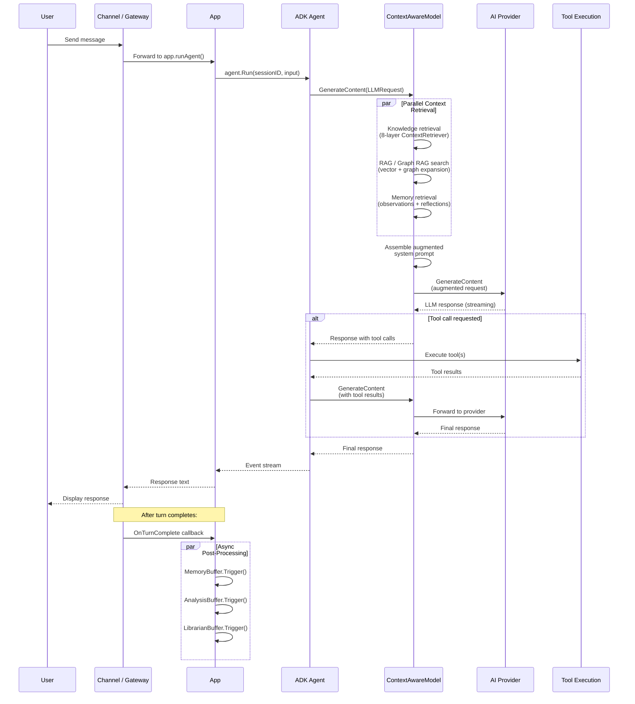
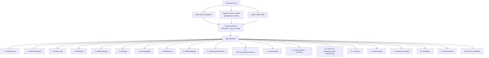
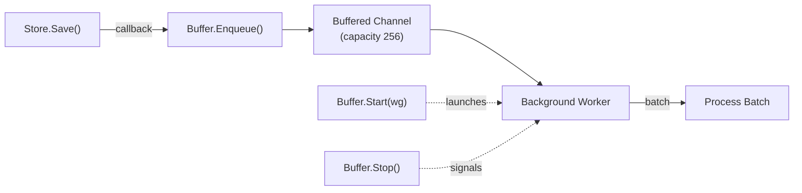

# Data Flow

This page describes how messages flow through Lango, how the application bootstraps and wires its components, and how async processing buffers work.

## Message Flow

The following diagram shows the end-to-end path of a user message from input to response.



### Flow Description

1. **Input.** A user sends a message through any channel (Telegram, Discord, Slack, CLI, WebSocket, or HTTP). The channel adapter normalizes the message and forwards it to the application.

2. **Session resolution.** The application resolves a session key from the channel context and injects it into the Go context via `session.SessionKeyFromContext`.

3. **Agent execution.** `ADK Agent.Run()` creates user content and passes it to the ADK runner, which calls `GenerateContent` on the model.

4. **Context assembly.** The `ContextAwareModelAdapter` intercepts `GenerateContent`. It extracts the last user message and runs three retrieval pipelines in parallel using `errgroup`:
    - **Knowledge retrieval** queries the 8-layer `ContextRetriever` for relevant knowledge entries, tool descriptions, runtime context, and skill patterns.
    - **RAG / Graph RAG** performs vector similarity search. If Graph RAG is enabled, it additionally expands results through the triple store to discover structurally connected context.
    - **Memory retrieval** loads recent observations and reflections for the current session.

5. **Prompt augmentation.** The retrieved context is appended to the base system prompt as structured sections (Knowledge Context, Semantic Context, Conversation Memory). The augmented prompt is set as the `SystemInstruction` on the request.

6. **Provider call.** The augmented request is forwarded to the configured AI provider (OpenAI, Gemini, or Claude) via the `Supervisor.ProviderProxy`.

7. **Tool execution.** If the provider's response contains tool calls, the ADK runner executes each tool and feeds results back for another LLM round. Tools may go through the approval provider first if approval policy is enabled.

8. **Response delivery.** The final text response streams back through the ADK runner to the channel, which formats and delivers it to the user.

9. **Post-processing.** After the turn completes, the Gateway fires `OnTurnComplete` callbacks that trigger async buffers for memory observation, conversation analysis, and proactive librarian processing.

## Bootstrap and Wiring

The application startup follows a two-phase process: bootstrap (database and crypto) followed by component wiring.



### Phase 1: Bootstrap (`bootstrap.Run()`)

Before the application starts, the bootstrap phase handles three critical tasks:

- **Database.** Opens the SQLite database and runs Ent schema migrations. The raw `*sql.DB` handle is preserved for SQLite-vec (vector store).
- **Crypto provider.** For the `local` provider, prompts for a passphrase and derives encryption keys. The initialized `CryptoProvider` is passed through to avoid re-prompting.
- **Config profile.** Loads the active configuration profile from the encrypted config store.

The result is a `bootstrap.Result` struct containing `DBClient`, `Crypto`, `RawDB`, and `Config` that gets passed to `app.New()`.

### Phase 2: Component Wiring (`app.New()`)

The `app.New()` function initializes components in dependency order. Each `init*` function follows the same pattern:

1. Check the configuration flag (e.g., `cfg.Knowledge.Enabled`).
2. If disabled, log and return `nil`.
3. If initialization fails, log a warning and return `nil` (graceful degradation).
4. If successful, return a component struct.

This ordering ensures that dependencies are available when needed:

- **Supervisor** is created first because it holds provider credentials needed by tools and the agent.
- **Session Store** is created early because most subsystems need database access.
- **Security** (crypto, keys, secrets) is set up before tools that need encryption.
- **Graph Store** is created before Knowledge because the `GraphEngine` variant needs a graph store reference.
- **Knowledge** is created before Embedding because the embed callback needs the knowledge store.
- **Embedding** is created after Knowledge and Memory so it can wire `SetEmbedCallback` on both stores.
- **Graph callbacks** are wired after all stores exist, connecting the entity extractor pipeline.
- **Approval wrapping** happens near the end, wrapping all tools with the composite approval provider.
- **Agent** is created last with all tools and the fully-configured LLM (possibly wrapped with `ContextAwareModelAdapter` and `PIIRedactingModelAdapter`).

## Async Buffer Pattern

Lango uses async buffers to decouple expensive processing (embedding generation, graph indexing, memory observation) from the request/response cycle. All buffers follow the same lifecycle pattern:



### Lifecycle

| Method | Description |
|--------|-------------|
| `Start(wg *sync.WaitGroup)` | Launches the background goroutine and increments the WaitGroup for graceful shutdown tracking |
| `Enqueue(request)` | Non-blocking send to the buffered channel. If the channel is full, the request is dropped and a drop counter is incremented |
| `Stop()` | Closes the stop channel, signaling the worker to drain remaining items and exit |

### Buffer Types

**EmbeddingBuffer** (`internal/embedding/buffer.go`)

- Collects `EmbedRequest` items (ID, collection, content, metadata).
- Processes in batches of 32 with a 2-second flush timeout.
- Calls the embedding provider to generate vectors and stores them in SQLite-vec.
- Triggered via `SetEmbedCallback` on Knowledge Store and Memory Store.

**GraphBuffer** (`internal/graph/buffer.go`)

- Collects `GraphRequest` items (lists of triples).
- Processes in batches of 64 with a 2-second flush timeout.
- Writes triples to the BoltDB triple store.
- Triggered via `SetGraphCallback` on Knowledge Store and Memory Store, plus the Entity Extractor and Learning GraphEngine.

**MemoryBuffer** (`internal/memory/buffer.go`)

- Triggered by `OnTurnComplete` gateway callback.
- Checks token thresholds (message tokens, observation tokens) to decide when to run.
- Calls `Observer` to extract observations from recent messages.
- Calls `Reflector` to synthesize reflections when observation count exceeds threshold.
- Supports memory compaction via `SetCompactor()` wired to `EntStore.CompactMessages`.

**AnalysisBuffer** (`internal/learning/analysis_buffer.go`)

- Triggered by `OnTurnComplete` gateway callback.
- Checks turn count and token thresholds.
- Runs `ConversationAnalyzer` for pattern extraction and `SessionLearner` for knowledge generation.

**LibrarianProactiveBuffer** (`internal/librarian/buffer.go`)

- Triggered by `OnTurnComplete` gateway callback.
- Runs `ObservationAnalyzer` to identify knowledge gaps.
- Runs `InquiryProcessor` to generate and auto-resolve inquiries above a confidence threshold.

### Callback Wiring

The callback pattern avoids import cycles between intelligence subsystems. Instead of direct function calls, stores expose setter methods for callbacks:

```
Knowledge Store ──SetEmbedCallback──> EmbeddingBuffer.Enqueue()
Knowledge Store ──SetGraphCallback──> GraphBuffer.Enqueue()
Memory Store    ──SetEmbedCallback──> EmbeddingBuffer.Enqueue()
Memory Store    ──SetGraphCallback──> GraphBuffer.Enqueue()
Memory Store    ──SetGraphHooks────> GraphBuffer.Enqueue() (temporal/session triples)
Learning Engine ──SetGraphCallback──> GraphBuffer.Enqueue() (confidence triples)
```

This wiring happens in `app.New()` after all components are initialized. The stores have no compile-time dependency on the buffers -- they only know about the callback function signature.
