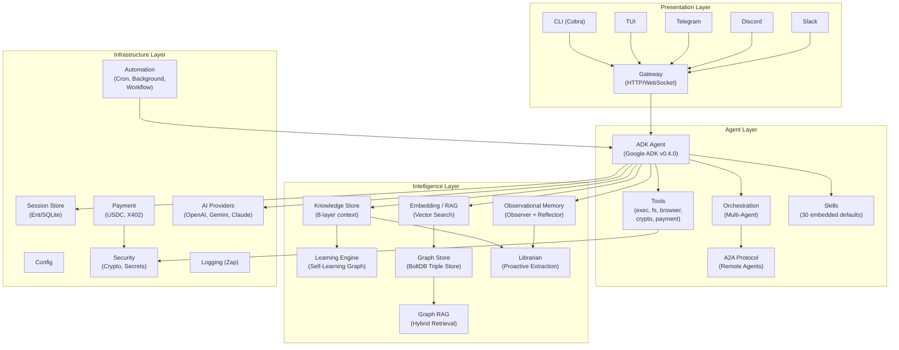

# System Overview

Lango is organized into four architectural layers. Each layer has a clear responsibility boundary, and dependencies flow strictly downward: Presentation depends on Agent, Agent depends on Intelligence, and all layers depend on Infrastructure.

## Architecture Diagram

## Layer Descriptions

### Presentation Layer

The presentation layer handles all user-facing interactions. It contains no business logic -- each component is a thin adapter that accepts input, forwards it to the Agent layer via the Gateway, and formats the response for output.

| Component | Package | Role |
|-----------|---------|------|
| **CLI** | `cmd/lango/`, `internal/cli/` | Cobra-based command tree (`lango agent`, `lango memory`, `lango graph`, etc.) |
| **TUI** | `internal/cli/tui/` | Terminal UI components for interactive sessions |
| **Channels** | `internal/channels/` | Telegram, Discord, and Slack bot integrations |
| **Gateway** | `internal/gateway/` | HTTP REST and WebSocket server with OIDC auth support, chi router |

### Agent Layer

The agent layer is the core runtime. It manages the AI agent lifecycle, tool execution, prompt assembly, and multi-agent orchestration.

| Component | Package | Role |
|-----------|---------|------|
| **ADK Agent** | `internal/adk/` | Wraps Google ADK v0.4.0 (`llmagent.New`, `runner.Runner`). Provides `Run`, `RunAndCollect`, and `RunStreaming` methods |
| **Context-Aware Model** | `internal/adk/context_model.go` | `ContextAwareModelAdapter` intercepts every LLM call to inject knowledge, memory, RAG, and Graph RAG context into the system prompt. Retrieval runs in parallel via `errgroup` |
| **Tool Adaptation** | `internal/adk/tools.go` | `AdaptTool()` converts internal `agent.Tool` definitions to ADK `tool.Tool` format with JSON Schema parameters |
| **Orchestration** | `internal/orchestration/` | Multi-agent tree with sub-agents: Operator, Navigator, Vault, Librarian, Automator, Planner, Chronicler |
| **A2A** | `internal/a2a/` | Agent-to-Agent protocol server for remote agent discovery and delegation |
| **Skills** | `internal/skill/` | File-based skill system with 30 embedded default skills deployed via `go:embed` |
| **Approval** | `internal/approval/` | Composite approval provider that routes sensitive tool execution confirmations to the appropriate channel (Gateway WebSocket, TTY, or headless auto-approve) |

### Intelligence Layer

The intelligence layer provides the agent with persistent knowledge, learning capabilities, and semantic retrieval. All components are optional and enabled via configuration flags.

| Component | Package | Role |
|-----------|---------|------|
| **Knowledge Store** | `internal/knowledge/` | Ent-backed store with an 8-layer `ContextRetriever` (runtime context, tool registry, user knowledge, skill patterns, external knowledge, agent learnings, pending inquiries, conversation analysis) |
| **Learning Engine** | `internal/learning/` | Extracts patterns from tool results. `GraphEngine` variant adds confidence propagation (rate 0.3) and triple generation |
| **Observational Memory** | `internal/memory/` | `Observer` extracts observations from conversation turns, `Reflector` synthesizes reflections, `Buffer` manages async processing with token thresholds |
| **Embedding / RAG** | `internal/embedding/` | Multi-provider embedding (OpenAI, Google, local), SQLite-vec vector store, `RAGService` for semantic retrieval |
| **Graph Store** | `internal/graph/` | BoltDB-backed triple store with SPO/POS/OSP indexes. `Extractor` uses LLM for entity/relation extraction |
| **Graph RAG** | `internal/graph/` | 2-phase hybrid retrieval: vector search finds seed results, then graph expansion discovers structurally connected context |
| **Librarian** | `internal/librarian/` | Proactive knowledge extraction: `ObservationAnalyzer` identifies knowledge gaps, `InquiryProcessor` generates and resolves inquiries |

### Infrastructure Layer

The infrastructure layer provides foundational services that all other layers depend on.

| Component | Package | Role |
|-----------|---------|------|
| **Config** | `internal/config/` | YAML config loading with environment variable substitution and validation |
| **Config Store** | `internal/configstore/` | Encrypted config profile storage (Ent-backed) |
| **Security** | `internal/security/` | Crypto providers (local passphrase-derived, RPC), key registry, secrets store, companion discovery |
| **Session** | `internal/session/` | Ent/SQLite session store with TTL and max history turns |
| **Logging** | `internal/logging/` | Structured logging via Zap with per-package loggers |
| **AI Providers** | `internal/provider/` | Unified interface with implementations for OpenAI, Google Gemini, and Anthropic Claude |
| **Supervisor** | `internal/supervisor/` | Provider proxy for credential management, privileged tool execution, fallback provider chains |
| **Payment** | `internal/payment/`, `internal/wallet/`, `internal/x402/` | USDC payments on EVM chains, wallet providers (local/RPC/composite), spending limiter, X402 V2 payment protocol |
| **Automation** | `internal/cron/`, `internal/background/`, `internal/workflow/` | Cron scheduler (robfig/cron/v3), in-memory background task manager, DAG-based YAML workflow engine |
| **Bootstrap** | `internal/bootstrap/` | Application startup: database initialization, crypto provider setup, config profile loading |

## Key Design Decisions

**Callback pattern for async processing.** Stores expose `SetEmbedCallback` and `SetGraphCallback` methods. When a knowledge entry or memory observation is saved, the callback enqueues an async request to the corresponding buffer (EmbeddingBuffer or GraphBuffer). This avoids import cycles between the intelligence subsystems.

**Optional subsystems with graceful degradation.** Every intelligence component checks a config flag during initialization. If a component fails to initialize (missing dependency, database error), the application continues without it. The `initKnowledge`, `initMemory`, `initEmbedding`, `initGraphStore` functions all return `nil` on failure rather than terminating the application.

**Context-aware prompt assembly.** The `ContextAwareModelAdapter` wraps the base LLM and intercepts every `GenerateContent` call. It runs knowledge retrieval, RAG search, and memory lookup in parallel using `errgroup`, then assembles the results into an augmented system prompt before forwarding to the AI provider.

**Tool adaptation layer.** Internal tools use a simple `agent.Tool` struct with a map-based parameter definition. The `adk.AdaptTool()` function converts these to the ADK's `tool.Tool` interface with proper JSON Schema, allowing tools to be defined without depending on ADK types directly.
