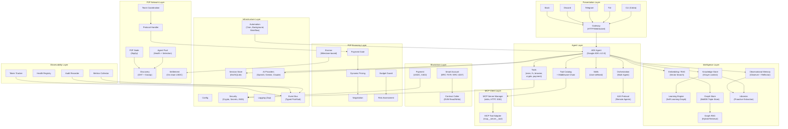

# System Overview

Lango is organized into six architectural layers. Each layer has a clear responsibility boundary, and dependencies flow strictly downward: Presentation depends on Agent, Agent depends on Intelligence, and all layers depend on Infrastructure. The MCP Integration, Blockchain, and P2P Economy layers sit alongside Agent and Infrastructure as specialized subsystems.

## Architecture Diagram

```mermaid
graph TB
    subgraph Presentation["Presentation Layer"]
        CLI["CLI (Cobra)"]
        TUI["TUI"]
        TG["Telegram"]
        DC["Discord"]
        SL["Slack"]
        GW["Gateway<br/>(HTTP/WebSocket)"]
    end

    subgraph AgentLayer["Agent Layer"]
        ADK["ADK Agent<br/>(Google ADK v1.0.0)"]
        ORCH["Orchestration<br/>(Multi-Agent)"]
        TOOLS["Tools<br/>(exec, fs, browser,<br/>crypto, payment)"]
        SKILL["Skills<br/>(User-defined)"]
        A2A["A2A Protocol<br/>(Remote Agents)"]
        TCAT["Tool Catalog<br/>+ Middleware Chain"]
    end

    subgraph MCPLayer["MCP Client Layer"]
        MCP["MCP Server Manager<br/>(stdio, HTTP, SSE)"]
        MCPT["MCP Tool Adapter<br/>(mcp__server__tool)"]
    end

    subgraph Intelligence["Intelligence Layer"]
        KS["Knowledge Store<br/>(8-layer context)"]
        LE["Learning Engine<br/>(Self-Learning Graph)"]
        MEM["Observational Memory<br/>(Observer + Reflector)"]
        EMB["Embedding / RAG<br/>(Vector Search)"]
        GR["Graph Store<br/>(BoltDB Triple Store)"]
        GRAM["Graph RAG<br/>(Hybrid Retrieval)"]
        LIB["Librarian<br/>(Proactive Extraction)"]
    end

    subgraph Blockchain["Blockchain Layer"]
        PAY["Payment<br/>(USDC, X402)"]
        SA["Smart Account<br/>(ERC-7579 / ERC-4337)"]
        CONT["Contract Caller<br/>(EVM Read/Write)"]
    end

    subgraph P2PEconomy["P2P Economy Layer"]
        PRICING["Dynamic Pricing"]
        NEGOT["Negotiation"]
        ESCROW["Escrow<br/>(Milestone-based)"]
        BUDGET["Budget Guard"]
        RISK["Risk Assessment"]
        PAYGATE["Payment Gate"]
    end

    subgraph P2PNet["P2P Network Layer"]
        NODE["P2P Node<br/>(libp2p)"]
        DISC["Discovery<br/>(DHT + Gossip)"]
        PROTO["Protocol Handler"]
        POOL["Agent Pool<br/>(Health + Selection)"]
        TEAM["Team Coordination"]
        SETTLE["Settlement<br/>(On-chain USDC)"]
    end

    subgraph Observ["Observability Layer"]
        METRICS["Metrics Collector"]
        HEALTH["Health Registry"]
        AUDIT["Audit Recorder"]
        TOKEN["Token Tracker"]
    end

    subgraph Infra["Infrastructure Layer"]
        CFG["Config"]
        SEC["Security<br/>(Crypto, Secrets, KMS)"]
        SESS["Session Store<br/>(Ent/SQLite)"]
        LOG["Logging (Zap)"]
        PROV["AI Providers<br/>(OpenAI, Gemini, Claude)"]
        AUTO["Automation<br/>(Cron, Background,<br/>Workflow)"]
        EBUS["Event Bus<br/>(Typed Pub/Sub)"]
    end

    CLI --> GW
    TUI --> GW
    TG --> GW
    DC --> GW
    SL --> GW
    GW --> ADK
    ADK --> ORCH
    ADK --> TOOLS
    ADK --> SKILL
    ADK --> TCAT
    ORCH --> A2A
    TCAT --> MCP
    MCP --> MCPT
    ADK --> PROV
    ADK --> KS
    ADK --> MEM
    ADK --> EMB
    KS --> LE
    EMB --> GR
    GR --> GRAM
    KS --> LIB
    MEM --> LIB
    ADK --> SESS
    TOOLS --> SEC
    PAY --> SEC
    SA --> CONT
    AUTO --> ADK
    PROTO --> PAYGATE
    PAYGATE --> PRICING
    PRICING --> NEGOT
    ESCROW --> SETTLE
    BUDGET --> RISK
    POOL --> DISC
    TEAM --> PROTO
    NODE --> DISC
    METRICS --> EBUS
    AUDIT --> EBUS
    TOKEN --> EBUS
```

## Layer Descriptions

### Presentation Layer

The presentation layer handles all user-facing interactions. It contains no business logic -- each component is a thin adapter that accepts input, forwards it to the Agent layer via the Gateway, and formats the response for output.

| Component | Package | Role |
|-----------|---------|------|
| **CLI** | `cmd/lango/`, `internal/cli/` | Cobra-based command tree (`lango agent`, `lango memory`, `lango graph`, `lango mcp`, `lango account`, `lango contract`, `lango economy`, `lango metrics`, etc.) |
| **TUI** | `internal/cli/tui/`, `internal/cli/tuicore/` | Terminal UI styling, banner components, and Bubbletea-based form manager for interactive sessions |
| **Channels** | `internal/channels/` | Telegram, Discord, and Slack bot integrations |
| **Gateway** | `internal/gateway/` | HTTP REST and WebSocket server with OIDC auth support, chi router |

### Agent Layer

The agent layer is the core runtime. It manages the AI agent lifecycle, tool execution, prompt assembly, and multi-agent orchestration.

| Component | Package | Role |
|-----------|---------|------|
| **ADK Agent** | `internal/adk/` | Wraps Google ADK v1.0.0 (`llmagent.New`, `runner.Runner`). Provides `Run`, `RunAndCollect`, and `RunStreaming` methods |
| **Context-Aware Model** | `internal/adk/context_model.go` | `ContextAwareModelAdapter` intercepts every LLM call to inject knowledge, memory, RAG, and Graph RAG context into the system prompt. Retrieval runs in parallel via `errgroup` |
| **Tool Adaptation** | `internal/adk/tools.go` | `AdaptTool()` converts internal `agent.Tool` definitions to ADK `tool.Tool` format with JSON Schema parameters |
| **Tool Catalog** | `internal/toolcatalog/` | Thread-safe tool registry with category grouping. All tools (built-in, MCP, P2P) are registered here before being passed to the agent |
| **Tool Middleware** | `internal/toolchain/` | HTTP-style middleware chain applied to tools: security filter, access control, event publishing, knowledge save, approval, browser recovery |
| **Orchestration** | `internal/orchestration/` | Multi-agent tree with sub-agents: Operator, Navigator, Vault, Librarian, Automator, Planner, Chronicler. Dynamic tool partitioning via multi-signal matching |
| **A2A** | `internal/a2a/` | Agent-to-Agent protocol server for remote agent discovery and delegation |
| **Skills** | `internal/skill/` | File-based skill system supporting user-defined skills. Infrastructure includes FileSkillStore, Registry, and GitHub importer |
| **Approval** | `internal/approval/` | Composite approval provider that routes sensitive tool execution confirmations to the appropriate channel (Gateway WebSocket, TTY, or headless auto-approve) |

### MCP Client Layer

The MCP client layer connects Lango to external tool servers via the Model Context Protocol. It discovers tools from configured MCP servers and adapts them into the agent's tool catalog.

| Component | Package | Role |
|-----------|---------|------|
| **Server Manager** | `internal/mcp/` | Manages multiple MCP server connections. Supports stdio (subprocess), HTTP streamable, and SSE transports. Multi-scope config merging (profile < user < project) |
| **Tool Adapter** | `internal/mcp/adapter.go` | `AdaptTools()` converts discovered MCP tools to `agent.Tool` instances using `mcp__{serverName}__{toolName}` naming. Translates MCP InputSchema to agent parameter definitions |
| **Config Loader** | `internal/mcp/config_loader.go` | Loads and merges MCP server configuration from multiple scopes: profile config, user-level `~/.lango/mcp.json`, and project-level `.lango-mcp.json` |

### Intelligence Layer

The intelligence layer provides the agent with persistent knowledge, learning capabilities, and semantic retrieval. All components are optional and enabled via configuration flags.

| Component | Package | Role |
|-----------|---------|------|
| **Knowledge Store** | `internal/knowledge/` | Ent-backed store with an 8-layer `ContextRetriever` (runtime context, tool registry, user knowledge, skill patterns, external knowledge, agent learnings, pending inquiries, conversation analysis) |
| **Learning Engine** | `internal/learning/` | Extracts patterns from tool results. `GraphEngine` variant adds confidence propagation (rate 0.3) and triple generation |
| **Observational Memory** | `internal/memory/` | `Observer` extracts observations from conversation turns, `Reflector` synthesizes reflections, `Buffer` manages async processing with token thresholds |
| **Embedding / RAG** | `internal/embedding/` | Multi-provider embedding (OpenAI, Google, local), SQLite-vec vector store, `RAGService` for semantic retrieval |
| **Graph Store** | `internal/graph/` | BoltDB-backed triple store with SPO/POS/OSP indexes. `Extractor` uses LLM for entity/relation extraction |
| **Graph RAG** | `internal/graph/` | 2-phase hybrid retrieval: vector search finds seed results, then graph expansion discovers structurally connected context |
| **Librarian** | `internal/librarian/` | Proactive knowledge extraction: `ObservationAnalyzer` identifies knowledge gaps, `InquiryProcessor` generates and resolves inquiries |

Production app and CLI layers consume DB-backed capabilities through `internal/storage` factories/readers rather than generic raw Ent/SQL handle access.

### Blockchain Layer

The blockchain layer provides on-chain capabilities for payments, smart contract interaction, and account abstraction.

| Component | Package | Role |
|-----------|---------|------|
| **Payment** | `internal/payment/`, `internal/wallet/` | USDC payments on EVM chains, wallet providers (local/RPC/composite), spending limiter |
| **X402** | `internal/x402/` | X402 V2 payment protocol. `Interceptor` handles automatic payment for 402 responses. EIP-3009 signing for gasless USDC transfers |
| **Contract Caller** | `internal/contract/` | Generic EVM smart contract interaction with ABI caching, EIP-1559 gas pricing, nonce management, and retry logic |
| **Smart Account** | `internal/smartaccount/` | ERC-7579 modular smart account management. Safe-based deployment, ERC-4337 UserOp submission, session key hierarchy, policy engine, module registry, and paymaster integration (Alchemy, Pimlico, Circle) |

### P2P Economy Layer

The P2P economy layer enables autonomous economic interactions between agents, including dynamic pricing, negotiation, escrow, and risk management.

| Component | Package | Role |
|-----------|---------|------|
| **Dynamic Pricing** | `internal/economy/pricing/` | Rule-based pricing engine with reputation-weighted adjustments. Computes per-tool prices with quote expiry |
| **Negotiation** | `internal/economy/negotiation/` | Multi-round price negotiation with turn-based protocol, strategy interface, and configurable round limits |
| **Escrow** | `internal/economy/escrow/` | Milestone-based escrow lifecycle (Pending through Released/Refunded). `sentinel/` sub-package for fraud detection. `hub/` sub-package for on-chain escrow vault interaction |
| **Budget** | `internal/economy/budget/` | Task-scoped budget management with spending limit enforcement and alert callbacks |
| **Risk** | `internal/economy/risk/` | 3-variable risk matrix assessment (trust score x transaction value x output verifiability) |
| **Payment Gate** | `internal/p2p/paygate/` | Sits between firewall and tool executor. Verifies EIP-3009 payment authorizations before allowing tool execution |

### P2P Network Layer

The P2P network layer provides decentralized agent communication, discovery, and coordination.

| Component | Package | Role |
|-----------|---------|------|
| **Node** | `internal/p2p/` | Core P2P node with libp2p host lifecycle and node key management |
| **Identity** | `internal/p2p/identity/` | DID-based peer identity management |
| **Discovery** | `internal/p2p/discovery/` | Peer discovery via Kademlia DHT and gossipsub. Agent advertisements (Context Flyer) via DHT provider records. Credential revocation support |
| **Handshake** | `internal/p2p/handshake/` | Authenticated handshake with signed challenges (ECDSA), timestamp validation, nonce replay protection, and session management |
| **Firewall** | `internal/p2p/firewall/` | Inbound request filtering with OwnerShield and ZK attestation verification |
| **Protocol** | `internal/p2p/protocol/` | Message handler for tool invocations with sandbox execution, security event tracking, and team message routing |
| **ZKP** | `internal/p2p/zkp/` | Zero-knowledge proof system with gnark circuits for attestation, capability, identity, and reputation proofs |
| **Agent Pool** | `internal/p2p/agentpool/` | Agent pool with health monitoring and weighted selection based on reputation, latency, success rate, and availability |
| **Team** | `internal/p2p/team/` | Task-scoped team coordination with roles (Leader, Worker, Reviewer, Observer) and budget tracking |
| **Settlement** | `internal/p2p/settlement/` | On-chain USDC settlement with EIP-3009 authorization and exponential retry |
| **Reputation** | `internal/p2p/reputation/` | Trust score tracking with interaction outcome recording and change notification callbacks |

### Observability Layer

The observability layer provides metrics collection, health monitoring, audit logging, and token usage tracking.

| Component | Package | Role |
|-----------|---------|------|
| **Metrics Collector** | `internal/observability/` | Thread-safe in-memory aggregation of token usage, tool executions, agent metrics, and session metrics. `SystemSnapshot` for point-in-time summaries |
| **Token Tracker** | `internal/observability/token/` | Subscribes to `TokenUsageEvent` on the event bus and forwards data to the collector and optional persistent store |
| **Health Registry** | `internal/observability/health/` | Manages health `Checker` instances and runs aggregate assessments. Per-component status: Healthy/Degraded/Unhealthy |
| **Audit Recorder** | `internal/observability/audit/` | Subscribes to tool execution and token usage events, writes entries to Ent-backed `AuditLog` |

### Infrastructure Layer

The infrastructure layer provides foundational services that all other layers depend on.

| Component | Package | Role |
|-----------|---------|------|
| **Config** | `internal/config/` | YAML config loading with environment variable substitution and validation |
| **Config Store** | `internal/configstore/` | Encrypted config profile storage (Ent-backed) |
| **Security** | `internal/security/` | Crypto providers (local passphrase-derived, RPC), key registry, secrets store, companion discovery. KMS providers (AWS KMS, GCP KMS, Azure Key Vault, PKCS#11) with retry and health checking |
| **Session** | `internal/session/` | Ent/SQLite session store with TTL and max history turns |
| **Logging** | `internal/logging/` | Structured logging via Zap with per-package loggers |
| **AI Providers** | `internal/provider/` | Unified interface with implementations for OpenAI, Google Gemini, and Anthropic Claude |
| **Supervisor** | `internal/supervisor/` | Provider proxy for credential management, privileged tool execution, fallback provider chains |
| **Event Bus** | `internal/eventbus/` | Typed synchronous pub/sub. `SubscribeTyped[T]()` for type-safe subscriptions. Foundation for decoupled event-driven communication across subsystems |
| **Automation** | `internal/cron/`, `internal/background/`, `internal/workflow/` | Cron scheduler (robfig/cron/v3), in-memory background task manager, DAG-based YAML workflow engine |
| **Bootstrap** | `internal/bootstrap/` | Application startup: database initialization, crypto provider setup, config profile loading |
| **Lifecycle** | `internal/lifecycle/` | Component lifecycle management with priority-ordered startup and reverse-order shutdown |
| **Keyring** | `internal/keyring/` | Hardware keyring integration (Touch ID / TPM 2.0) via go-keyring |
| **Sandbox** | `internal/sandbox/` | Tool execution isolation with subprocess, Docker, gVisor, and native runtime fallback chain |
| **DB Migration** | `internal/dbmigrate/` | Legacy DB migration tombstones and remediation helpers |

## Key Design Decisions

**Callback pattern for async processing.** Stores expose `SetEmbedCallback` and `SetGraphCallback` methods. When a knowledge entry or memory observation is saved, the callback enqueues an async request to the corresponding buffer (EmbeddingBuffer or GraphBuffer). This avoids import cycles between the intelligence subsystems.

**Optional subsystems with graceful degradation.** Every intelligence component checks a config flag during initialization. If a component fails to initialize (missing dependency, database error), the application continues without it. The `initKnowledge`, `initMemory`, `initEmbedding`, `initGraphStore` functions all return `nil` on failure rather than terminating the application.

**Context-aware prompt assembly.** The `ContextAwareModelAdapter` wraps the base LLM and intercepts every `GenerateContent` call. It runs knowledge retrieval, RAG search, and memory lookup in parallel using `errgroup`, then assembles the results into an augmented system prompt before forwarding to the AI provider.

**Tool adaptation layer.** Internal tools use a simple `agent.Tool` struct with a map-based parameter definition. The `adk.AdaptTool()` function converts these to the ADK's `tool.Tool` interface with proper JSON Schema, allowing tools to be defined without depending on ADK types directly. MCP tools follow the same pattern through `mcp.AdaptTool()`.

**Event-driven observability.** The observability layer uses the event bus for decoupled data collection. Tool execution events and token usage events are published by the toolchain middleware and model adapter respectively, then consumed by the metrics collector, audit recorder, and token tracker without direct dependencies.

**Domain-specific wiring files.** Application initialization is split across `wiring_*.go` files in `internal/app/`, each responsible for a single subsystem (e.g., `wiring_mcp.go`, `wiring_payment.go`, `wiring_economy.go`). This keeps the bootstrap code organized as the number of subsystems grows.
