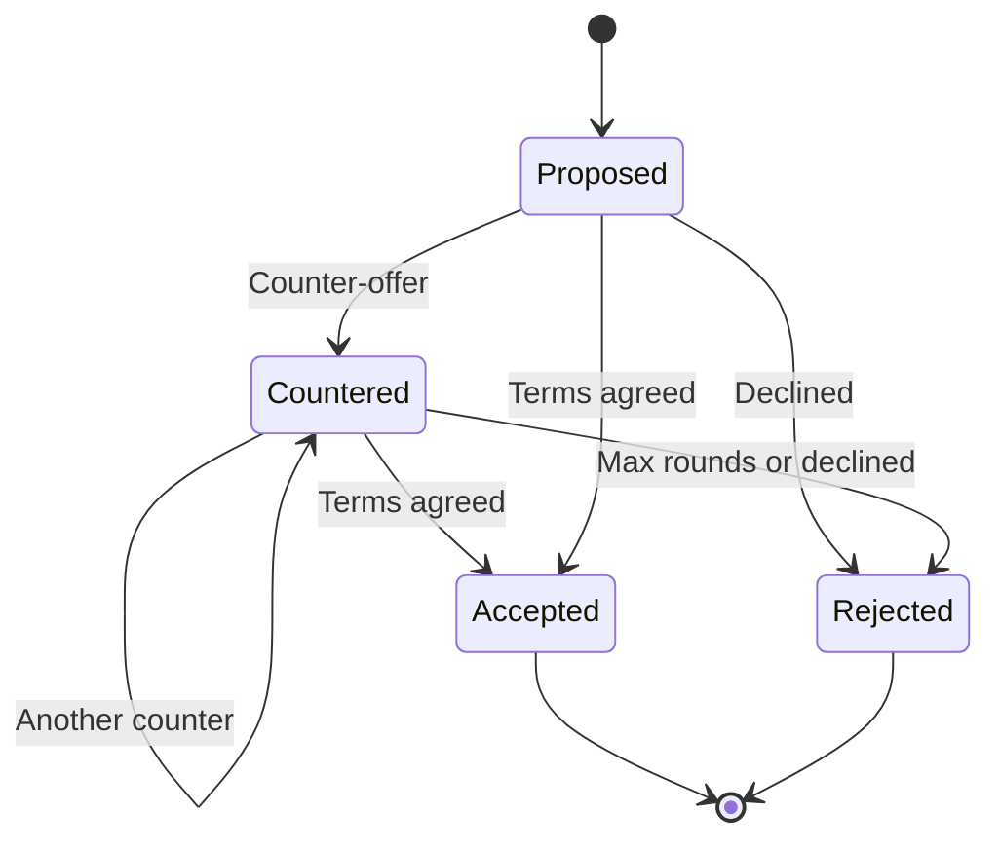
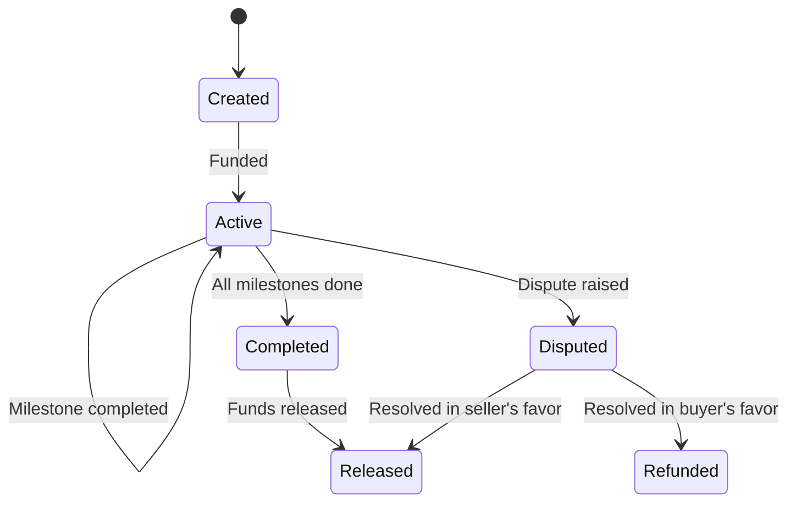

# P2P Economy

!!! warning "Experimental"

    The P2P economy system is experimental. The configuration and event model may change in future releases.

Lango includes a P2P economy layer that manages the financial lifecycle of inter-agent transactions. It consists of five sub-systems: Budget Manager, Risk Assessor, Dynamic Pricer, Negotiation Engine, and Escrow Service.

## Overview

The economy layer coordinates spending, risk, pricing, negotiation, and settlement for paid P2P tool invocations:

- **Budget Manager** -- per-task spending limits with threshold alerts and hard caps
- **Risk Assessment** -- trust-based payment strategy routing (DirectPay, Escrow, EscrowWithZK, Reject)
- **Dynamic Pricing** -- peer-specific discounts based on trust score and volume
- **Negotiation Engine** -- multi-round price negotiation protocol with auto-negotiation
- **Escrow Service** -- milestone-based escrow with dispute resolution and on-chain settlement


## Budget Manager

The budget manager enforces per-task spending limits. Each task gets an isolated budget that tracks spending against a configurable cap.

### Configuration

| Key | Default | Description |
|-----|---------|-------------|
| `economy.budget.defaultMax` | `"10.00"` | Default maximum budget per task in USDC |
| `economy.budget.alertThresholds` | `[0.5, 0.8, 0.95]` | Percentage thresholds that trigger `BudgetAlertEvent` |
| `economy.budget.hardLimit` | `true` | Rejects transactions that would exceed the budget |

### Agent Tools

| Tool | Description |
|------|-------------|
| `economy_budget_allocate` | Allocate a spending budget for a task (amount in USDC) |
| `economy_budget_status` | Check budget burn rate for a task |
| `economy_budget_close` | Close a task budget and get final spend report |

### Events

| Event | Description |
|-------|-------------|
| `budget.alert` | Task budget crossed a configured threshold (e.g. 50%, 80%) |
| `budget.exhausted` | Task budget fully consumed |

## Risk Assessment

The risk assessor evaluates each transaction and recommends a payment strategy based on peer trust score, transaction amount, and output verifiability.

### Risk Levels

| Risk Level | Strategy | Condition |
|------------|----------|-----------|
| Low | `DirectPay` | Trust score >= `highTrustScore` and amount below escrow threshold |
| Medium | `Escrow` | Trust score >= `mediumTrustScore` |
| High | `EscrowWithZK` | Trust score below `mediumTrustScore` |
| Critical | `Reject` | Transaction rejected entirely |

### Configuration

| Key | Default | Description |
|-----|---------|-------------|
| `economy.risk.escrowThreshold` | `"5.00"` | USDC amount above which escrow is forced |
| `economy.risk.highTrustScore` | `0.8` | Minimum trust score for DirectPay |
| `economy.risk.mediumTrustScore` | `0.5` | Minimum trust score for non-ZK strategies |

### Agent Tools

| Tool | Description |
|------|-------------|
| `economy_risk_assess` | Assess risk for a transaction with a peer (returns risk level, strategy, explanation) |

## Dynamic Pricing

The dynamic pricer adjusts tool prices per-peer based on trust and transaction volume. High-trust peers receive a trust discount, and high-volume peers receive a volume discount. A configurable minimum price floor prevents prices from dropping too low.

### Configuration

| Key | Default | Description |
|-----|---------|-------------|
| `economy.pricing.enabled` | `false` | Activates dynamic pricing |
| `economy.pricing.trustDiscount` | `0.1` | Maximum discount for high-trust peers (0-1) |
| `economy.pricing.volumeDiscount` | `0.05` | Maximum discount for high-volume peers (0-1) |
| `economy.pricing.minPrice` | `"0.01"` | Minimum price floor in USDC |

### Agent Tools

| Tool | Description |
|------|-------------|
| `economy_price_quote` | Get a price quote for a tool, optionally with peer-specific discounts |

## Negotiation

The negotiation engine supports multi-round price negotiation between peers. Sessions follow a Propose -> Counter -> Accept/Reject lifecycle with configurable round limits and timeouts.

### Lifecycle



### Configuration

| Key | Default | Description |
|-----|---------|-------------|
| `economy.negotiate.enabled` | `false` | Activates the negotiation protocol |
| `economy.negotiate.maxRounds` | `5` | Maximum counter-offer rounds |
| `economy.negotiate.timeout` | `5m` | Negotiation session timeout |
| `economy.negotiate.autoNegotiate` | `false` | Enables automatic counter-offer generation |
| `economy.negotiate.maxDiscount` | `0.2` | Maximum discount for auto-negotiation (0-1) |

### Agent Tools

| Tool | Description |
|------|-------------|
| `economy_negotiate` | Start a price negotiation with a peer |
| `economy_negotiate_status` | Check the status of a negotiation session |

### Events

| Event | Description |
|-------|-------------|
| `negotiation.started` | Negotiation session opened between two peers |
| `negotiation.completed` | Negotiation terms agreed |
| `negotiation.failed` | Negotiation rejected, expired, or cancelled |

## Escrow

The escrow service holds funds in a milestone-based escrow between buyer and seller. Funds are released when all milestones are completed, or refunded if a dispute is raised within the dispute window.

### Lifecycle



### Configuration

| Key | Default | Description |
|-----|---------|-------------|
| `economy.escrow.enabled` | `false` | Activates the escrow service |
| `economy.escrow.defaultTimeout` | `24h` | Escrow expiration timeout |
| `economy.escrow.maxMilestones` | `10` | Maximum milestones per escrow |
| `economy.escrow.autoRelease` | `false` | Release funds automatically when all milestones complete |
| `economy.escrow.disputeWindow` | `1h` | Time window for raising disputes after completion |
| `economy.escrow.settlement.receiptTimeout` | `2m` | Max wait for on-chain receipt confirmation |
| `economy.escrow.settlement.maxRetries` | `3` | Max transaction submission retries |

### Agent Tools

| Tool | Description |
|------|-------------|
| `economy_escrow_create` | Create a milestone-based escrow between buyer and seller |
| `economy_escrow_milestone` | Complete a milestone in an escrow |
| `economy_escrow_status` | Check escrow status and milestone progress |
| `economy_escrow_release` | Release escrow funds to seller |
| `economy_escrow_dispute` | Raise a dispute on an escrow |

### Events

| Event | Description |
|-------|-------------|
| `escrow.created` | Escrow locked between payer and payee |
| `escrow.milestone` | Escrow milestone completed |
| `escrow.released` | Escrow funds released on-chain |

## Events Summary

All economy events are published on the event bus:

| Event | Description |
|-------|-------------|
| `budget.alert` | Task budget crossed a configured threshold |
| `budget.exhausted` | Task budget fully consumed |
| `negotiation.started` | Negotiation session opened |
| `negotiation.completed` | Negotiation terms agreed |
| `negotiation.failed` | Negotiation rejected, expired, or cancelled |
| `escrow.created` | Escrow locked between payer and payee |
| `escrow.milestone` | Escrow milestone completed |
| `escrow.released` | Escrow funds released on-chain |

## Configuration

> **Settings:** `lango settings` -> Economy

```json
{
  "economy": {
    "enabled": true,
    "budget": {
      "defaultMax": "10.00",
      "alertThresholds": [0.5, 0.8, 0.95],
      "hardLimit": true
    },
    "risk": {
      "escrowThreshold": "5.00",
      "highTrustScore": 0.8,
      "mediumTrustScore": 0.5
    },
    "pricing": {
      "enabled": true,
      "trustDiscount": 0.1,
      "volumeDiscount": 0.05,
      "minPrice": "0.01"
    },
    "negotiate": {
      "enabled": true,
      "maxRounds": 5,
      "timeout": "5m",
      "autoNegotiate": false,
      "maxDiscount": 0.2
    },
    "escrow": {
      "enabled": true,
      "defaultTimeout": "24h",
      "maxMilestones": 10,
      "autoRelease": false,
      "disputeWindow": "1h",
      "settlement": {
        "receiptTimeout": "2m",
        "maxRetries": 3
      }
    }
  }
}
```

See the [Economy CLI Reference](../cli/economy.md) for command documentation.
