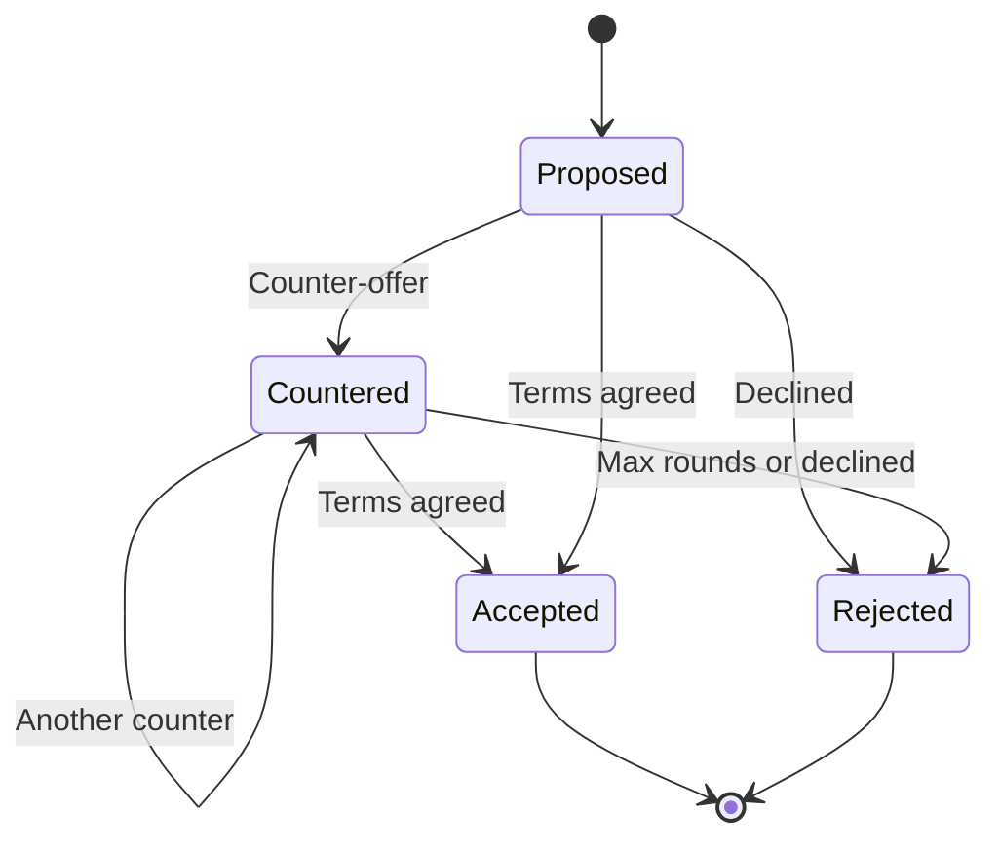
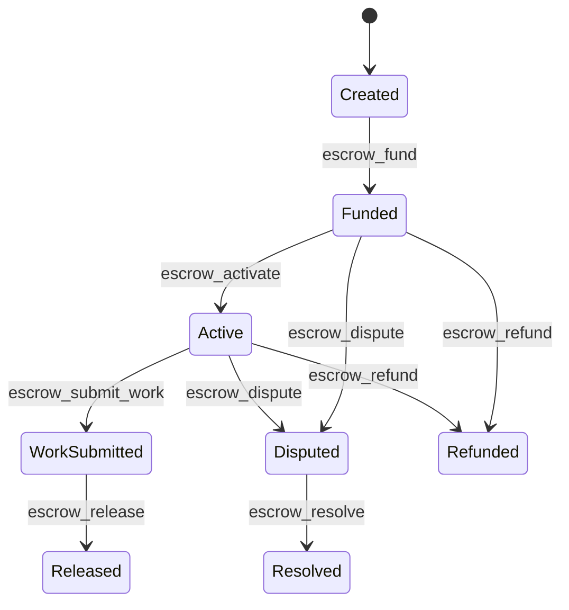

# P2P Economy

!!! warning "Experimental"

    The P2P economy system is experimental. The configuration and event model may change in future releases.

Lango includes a P2P economy layer that manages the financial lifecycle of inter-agent transactions. It consists of five sub-systems: Budget Manager, Risk Assessor, Dynamic Pricer, Negotiation Engine, and Escrow Service.

The economy subsystem is the local policy layer for dynamic pricing, negotiation, risk, and escrow.
It may influence public P2P exchange behavior, but it is not the same thing as the provider-side quote surface exposed through `p2p.pricing`.
`economy.pricing`, `economy.negotiation`, and `economy.escrow` are policy and engine surfaces layered above the P2P market path.

## Overview

The economy layer coordinates spending, risk, pricing, negotiation, and settlement for paid P2P tool invocations:

- **Budget Manager** -- per-task spending limits with threshold alerts and hard caps
- **Risk Assessment** -- trust-based payment strategy routing (DirectPay, Escrow, EscrowWithZK, Reject)
- **Dynamic Pricing** -- peer-specific discounts based on trust score and volume
- **Negotiation Engine** -- multi-round price negotiation protocol with auto-negotiation
- **Escrow Service** -- milestone-based escrow with dispute resolution and on-chain settlement

Admission trust and payment trust are separate gates: `minTrustScore` governs whether a peer clears the P2P firewall, while `postPayMinScore` governs whether a paid request can settle after execution.


## Budget Manager

The budget manager enforces per-task spending limits. Each task gets an isolated budget that tracks spending against a configurable cap.

### Configuration

| Key | Default | Description |
|-----|---------|-------------|
| `economy.budget.defaultMax` | `"10.00"` | Default maximum budget per task in USDC |
| `economy.budget.alertThresholds` | `[0.5, 0.8, 0.95]` | Percentage thresholds that trigger `BudgetAlertEvent` |
| `economy.budget.hardLimit` | `true` | Rejects transactions that would exceed the budget |

### Agent Tools

| Tool | Description |
|------|-------------|
| `economy_budget_allocate` | Allocate a spending budget for a task (amount in USDC) |
| `economy_budget_status` | Check budget burn rate for a task |
| `economy_budget_close` | Close a task budget and get final spend report |

### Events

| Event | Description |
|-------|-------------|
| `budget.alert` | Task budget crossed a configured threshold (e.g. 50%, 80%) |
| `budget.exhausted` | Task budget fully consumed |

## Risk Assessment

The risk assessor evaluates each transaction and recommends a payment strategy based on peer trust score, transaction amount, and output verifiability.

### Risk Levels

| Risk Level | Strategy | Condition |
|------------|----------|-----------|
| Low | `DirectPay` | Trust score >= `highTrustScore` and amount below escrow threshold |
| Medium | `Escrow` | Trust score >= `mediumTrustScore` |
| High | `EscrowWithZK` | Trust score below `mediumTrustScore` |
| Critical | `Reject` | Transaction rejected entirely |

### Configuration

| Key | Default | Description |
|-----|---------|-------------|
| `economy.risk.escrowThreshold` | `"5.00"` | USDC amount above which escrow is forced |
| `economy.risk.highTrustScore` | `0.8` | Minimum trust score for DirectPay |
| `economy.risk.mediumTrustScore` | `0.5` | Minimum trust score for non-ZK strategies |

### Agent Tools

| Tool | Description |
|------|-------------|
| `economy_risk_assess` | Assess risk for a transaction with a peer (returns risk level, strategy, explanation) |

## Dynamic Pricing

The dynamic pricer adjusts tool prices per-peer based on trust and transaction volume. High-trust peers receive a trust discount, and high-volume peers receive a volume discount. A configurable minimum price floor prevents prices from dropping too low.

### Configuration

| Key | Default | Description |
|-----|---------|-------------|
| `economy.pricing.enabled` | `false` | Activates dynamic pricing |
| `economy.pricing.trustDiscount` | `0.1` | Maximum discount for high-trust peers (0-1) |
| `economy.pricing.volumeDiscount` | `0.05` | Maximum discount for high-volume peers (0-1) |
| `economy.pricing.minPrice` | `"0.01"` | Minimum price floor in USDC |

### Agent Tools

| Tool | Description |
|------|-------------|
| `economy_price_quote` | Get a price quote for a tool, optionally with peer-specific discounts |

## Negotiation

The negotiation engine supports multi-round price negotiation between peers. Sessions follow a Propose -> Counter -> Accept/Reject lifecycle with configurable round limits and timeouts.

### Lifecycle



### Configuration

| Key | Default | Description |
|-----|---------|-------------|
| `economy.negotiate.enabled` | `false` | Activates the negotiation protocol |
| `economy.negotiate.maxRounds` | `5` | Maximum counter-offer rounds |
| `economy.negotiate.timeout` | `5m` | Negotiation session timeout |
| `economy.negotiate.autoNegotiate` | `false` | Enables automatic counter-offer generation |
| `economy.negotiate.maxDiscount` | `0.2` | Maximum discount for auto-negotiation (0-1) |

### Agent Tools

| Tool | Description |
|------|-------------|
| `economy_negotiate` | Start a price negotiation with a peer |
| `economy_negotiate_status` | Check the status of a negotiation session |

### Events

| Event | Description |
|-------|-------------|
| `negotiation.started` | Negotiation session opened between two peers |
| `negotiation.completed` | Negotiation terms agreed |
| `negotiation.failed` | Negotiation rejected, expired, or cancelled |

## Escrow

The escrow service holds funds in a milestone-based escrow between buyer and seller. The escrow follows a structured lifecycle from creation through settlement, with support for dispute resolution.

### Lifecycle



### Configuration

| Key | Default | Description |
|-----|---------|-------------|
| `economy.escrow.enabled` | `false` | Activates the escrow service |
| `economy.escrow.defaultTimeout` | `24h` | Escrow expiration timeout |
| `economy.escrow.maxMilestones` | `10` | Maximum milestones per escrow |
| `economy.escrow.autoRelease` | `false` | Release funds automatically when all milestones complete |
| `economy.escrow.disputeWindow` | `1h` | Time window for raising disputes after completion |
| `economy.escrow.settlement.receiptTimeout` | `2m` | Max wait for on-chain receipt confirmation |
| `economy.escrow.settlement.maxRetries` | `3` | Max transaction submission retries |

### Agent Tools

| Tool | Description |
|------|-------------|
| `escrow_create` | Create a new escrow deal between buyer and seller with milestones |
| `escrow_fund` | Fund an escrow with USDC (deposits to contract if on-chain) |
| `escrow_activate` | Activate a funded escrow so work can begin |
| `escrow_submit_work` | Submit a work hash as proof of completion |
| `escrow_release` | Release escrow funds to the seller |
| `escrow_refund` | Refund escrow funds to the buyer |
| `escrow_dispute` | Raise a dispute on an escrow |
| `escrow_resolve` | Resolve a disputed escrow as arbitrator |
| `escrow_status` | Get detailed escrow status including on-chain state |
| `escrow_list` | List all escrows with optional filter |

### Events

| Event | Description |
|-------|-------------|
| `escrow.created` | Escrow locked between payer and payee |
| `escrow.funded` | Escrow funded with USDC |
| `escrow.activated` | Escrow activated for work |
| `escrow.work_submitted` | Work proof submitted |
| `escrow.released` | Escrow funds released |
| `escrow.refunded` | Escrow funds refunded to buyer |
| `escrow.disputed` | Dispute raised on escrow |
| `escrow.resolved` | Dispute resolved by arbitrator |

## On-Chain Escrow

When on-chain settlement is enabled, escrow operations are backed by Solidity smart contracts deployed on an EVM-compatible chain. Lango supports two on-chain modes:

### Hub Mode

Uses a single **LangoEscrowHub** contract that holds multiple deals. All escrows share one contract address, reducing deployment costs. This is the default on-chain mode.

### Vault Mode

Uses **LangoVaultFactory** to deploy a per-deal **LangoVault** via EIP-1167 minimal proxy (clone). Each escrow gets its own isolated contract instance, providing stronger separation of funds.

### Hub V2

The `HubV2Client` provides typed access to the UUPS-upgradeable **LangoEscrowHubV2** contract. It extends V1 with `refId` support (a `[32]byte` reference identifier for cross-system correlation) and new deal types.

**Key methods:**

| Method | Description |
|--------|-------------|
| `DirectSettle` | Transfer tokens directly from buyer to seller without escrow (instant settlement with `refId`) |
| `CreateSimpleEscrow` | Create a simple escrow deal with `refId` |
| `CreateMilestoneEscrow` | Create a milestone-based escrow with per-milestone amounts and `refId` |
| `CreateTeamEscrow` | Create a team escrow with proportional shares across multiple members |
| `CompleteMilestone` | Mark a specific milestone index as completed |
| `ReleaseMilestone` | Release funds for all completed milestones |
| `GetDealV2` | Read on-chain deal state including `refId`, `DealType`, and `Settler` |

**On-chain deal types:** Simple, Milestone, Team.

The V2 event monitor auto-detects V1 vs V2 events by topic count (V2 events have `refId` as an extra indexed parameter, giving them 4 topics instead of 3).

Source: `internal/economy/escrow/hub/client_v2.go`

### Milestone Settler

The `HubSettler` implements `SettlementExecutor` using the LangoEscrowHub contract. It manages the full on-chain lifecycle:

- **Lock** -- Creates a deal on-chain and deposits funds. Maps `buyerDID` to the on-chain `dealID` for future operations.
- **Release** -- Releases funds to the seller by looking up the deal ID from the DID mapping.
- **Refund** -- Refunds funds to the buyer and removes the deal mapping.

The settler supports offline mode (`NewHubSettlerOffline`) where all on-chain operations become no-ops with warning logs, useful for testing.

Deal ID mappings can be set explicitly via `SetDealMapping(escrowID, dealID)` or `SetDealMappingByDID(did, dealID)` for integration with the team-escrow bridge.

Source: `internal/economy/escrow/hub/hub_settler.go`

### Dangling Escrow Detector

The `DanglingDetector` is a lifecycle component that periodically scans for escrows stuck in `Pending` status longer than a configurable threshold. It auto-expires stale escrows and publishes an `EscrowDanglingEvent`.

**Behavior:**

1. Every `scanInterval` (default: 5m), query all escrows with `StatusPending` created before `now - maxPending`
2. For each dangling escrow, call `engine.Expire()` to transition it to expired
3. Publish `EscrowDanglingEvent` with escrow details and `action: "expired"`

| Config | Default | Description |
|--------|---------|-------------|
| `scanInterval` | `5m` | Time between scan sweeps |
| `maxPending` | `10m` | Maximum time an escrow can stay in Pending |

Source: `internal/economy/escrow/hub/dangling_detector.go`

### On-Chain Deal States

```
Created --> Deposited --> WorkSubmitted --> Released
                 |              |
             Disputed      Refunded
                 |
             Resolved
```

### On-Chain Configuration

| Key | Default | Description |
|-----|---------|-------------|
| `economy.escrow.onChain.enabled` | `false` | Enable on-chain escrow settlement |
| `economy.escrow.onChain.mode` | `"hub"` | On-chain mode: `hub` or `vault` |
| `economy.escrow.onChain.hubAddress` | `-` | Deployed LangoEscrowHub contract address |
| `economy.escrow.onChain.vaultFactoryAddress` | `-` | Deployed LangoVaultFactory contract address |
| `economy.escrow.onChain.vaultImplementation` | `-` | LangoVault implementation address for cloning |
| `economy.escrow.onChain.arbitratorAddress` | `-` | On-chain arbitrator wallet address |
| `economy.escrow.onChain.tokenAddress` | `-` | ERC-20 token (USDC) contract address |
| `economy.escrow.onChain.pollInterval` | `15s` | Interval for polling on-chain state |
| `economy.escrow.onChain.confirmationDepth` | `2` | Blocks to wait before processing events (reorg protection) |
| `economy.escrow.onChain.directSettlerAddress` | `-` | Deployed DirectSettler contract address (V2) |
| `economy.escrow.onChain.milestoneSettlerAddress` | `-` | Deployed MilestoneSettler contract address (V2) |

### On-Chain Events

| Event | Description |
|-------|-------------|
| `escrow.onchain.deposit` | Tokens deposited into on-chain escrow |
| `escrow.onchain.work` | Work proof submitted on-chain |
| `escrow.onchain.release` | On-chain escrow funds released |
| `escrow.onchain.refund` | On-chain escrow funds refunded |
| `escrow.onchain.dispute` | On-chain dispute raised |
| `escrow.onchain.resolved` | On-chain dispute resolved |

### Smart Account Integration

When smart accounts are enabled (`smartAccount.enabled`), the economy layer integrates with three smart account components:

- **On-Chain Spending Tracker** — Tracks session key spending against budget limits. Budget alerts trigger when thresholds are crossed.
- **Session Guard** — The Security Sentinel can trigger emergency session key revocation when anomalies are detected (rapid creation, large withdrawal, repeated dispute).
- **Risk Adapter** — The risk engine feeds into the smart account policy engine, dynamically adjusting spending limits based on peer trust scores.

See [Smart Accounts](smart-accounts.md) for full details.

## Security Sentinel

The Security Sentinel monitors escrow activity for suspicious patterns and generates alerts. It runs as a background engine that analyzes escrow events in real time.

### Detectors

| Detector | Description |
|----------|-------------|
| **RapidCreation** | Flags agents creating many escrows in a short window |
| **LargeWithdrawal** | Flags unusually large fund releases or refunds |
| **RepeatedDispute** | Flags agents with a high dispute-to-completion ratio |
| **UnusualTiming** | Flags escrow operations outside normal hours |
| **BalanceDrop (WashTrade)** | Flags circular fund flows suggesting wash trading |

### Alert Severity

Alerts are categorized by severity: `critical`, `high`, `medium`, `low`.

### Agent Tools

| Tool | Description |
|------|-------------|
| `sentinel_status` | Get Sentinel engine status (running state, alert counts) |
| `sentinel_alerts` | List security alerts with optional severity filter |
| `sentinel_config` | Show current detection thresholds |
| `sentinel_acknowledge` | Acknowledge and dismiss an alert by ID |

## Events Summary

All economy events are published on the event bus:

| Event | Description |
|-------|-------------|
| `budget.alert` | Task budget crossed a configured threshold |
| `budget.exhausted` | Task budget fully consumed |
| `negotiation.started` | Negotiation session opened |
| `negotiation.completed` | Negotiation terms agreed |
| `negotiation.failed` | Negotiation rejected, expired, or cancelled |
| `escrow.created` | Escrow locked between payer and payee |
| `escrow.funded` | Escrow funded with USDC |
| `escrow.activated` | Escrow activated for work |
| `escrow.work_submitted` | Work proof submitted |
| `escrow.released` | Escrow funds released |
| `escrow.refunded` | Escrow funds refunded to buyer |
| `escrow.disputed` | Dispute raised on escrow |
| `escrow.resolved` | Dispute resolved by arbitrator |
| `escrow.onchain.deposit` | Tokens deposited into on-chain escrow |
| `escrow.onchain.work` | Work proof submitted on-chain |
| `escrow.onchain.release` | On-chain escrow funds released |
| `escrow.onchain.refund` | On-chain escrow funds refunded |
| `escrow.onchain.dispute` | On-chain dispute raised |
| `escrow.onchain.resolved` | On-chain dispute resolved |
| `escrow.reorg.detected` | Chain reorganization detected by event monitor |
| `escrow.dangling` | Escrow stuck in Pending auto-expired |

## Configuration

> **Settings:** `lango settings` -> Economy

```json
{
  "economy": {
    "enabled": true,
    "budget": {
      "defaultMax": "10.00",
      "alertThresholds": [0.5, 0.8, 0.95],
      "hardLimit": true
    },
    "risk": {
      "escrowThreshold": "5.00",
      "highTrustScore": 0.8,
      "mediumTrustScore": 0.5
    },
    "pricing": {
      "enabled": true,
      "trustDiscount": 0.1,
      "volumeDiscount": 0.05,
      "minPrice": "0.01"
    },
    "negotiate": {
      "enabled": true,
      "maxRounds": 5,
      "timeout": "5m",
      "autoNegotiate": false,
      "maxDiscount": 0.2
    },
    "escrow": {
      "enabled": true,
      "defaultTimeout": "24h",
      "maxMilestones": 10,
      "autoRelease": false,
      "disputeWindow": "1h",
      "settlement": {
        "receiptTimeout": "2m",
        "maxRetries": 3
      },
      "onChain": {
        "enabled": false,
        "mode": "hub",
        "hubAddress": "",
        "vaultFactoryAddress": "",
        "vaultImplementation": "",
        "arbitratorAddress": "",
        "tokenAddress": "",
        "pollInterval": "15s",
        "confirmationDepth": 2,
        "directSettlerAddress": "",
        "milestoneSettlerAddress": ""
      }
    }
  }
}
```

See the [Economy CLI Reference](../cli/economy.md) for command documentation.
