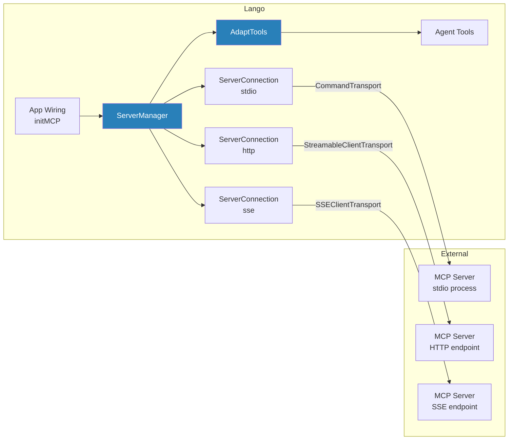

# MCP Integration

!!! info "Plugin System"

    MCP (Model Context Protocol) integration allows Lango to connect to external MCP servers and expose their tools to the agent. This enables extensibility through a standardized tool protocol.

Lango acts as an MCP **client**, connecting to one or more external MCP servers to discover and invoke their tools. Discovered tools are automatically adapted into native `agent.Tool` instances and passed through the full middleware chain (hooks, approval, learning).

## Architecture



### Key Components

| Component | Package | Role |
|-----------|---------|------|
| `ServerManager` | `internal/mcp` | Manages multiple server connections; connects/disconnects all servers |
| `ServerConnection` | `internal/mcp` | Lifecycle of a single MCP server (connect, health check, reconnect, disconnect) |
| `AdaptTools` | `internal/mcp` | Converts discovered MCP tools into `agent.Tool` instances |
| `MergedServers` | `internal/mcp` | Loads and merges server configs from three scopes |
| `initMCP` | `internal/app` | Wiring function that initializes the MCP subsystem during app startup |

## Transport Types

Lango supports three MCP transport types:

| Transport | SDK Type | Requirement | Use Case |
|-----------|----------|-------------|----------|
| `stdio` | `CommandTransport` | `command` field | Local tool servers spawned as child processes |
| `http` | `StreamableClientTransport` | `url` field | Remote servers with HTTP streaming |
| `sse` | `SSEClientTransport` | `url` field | Remote servers with Server-Sent Events |

For `http` and `sse` transports, custom HTTP headers (e.g., authentication) are injected via a `headerRoundTripper` on every request.

## Configuration

### Global Settings

| Key | Type | Default | Description |
|-----|------|---------|-------------|
| `mcp.enabled` | bool | `false` | Enable MCP integration |
| `mcp.defaultTimeout` | duration | `30s` | Default connection and call timeout |
| `mcp.maxOutputTokens` | int | `25000` | Max output tokens for tool results (truncated at ~4 chars/token) |
| `mcp.healthCheckInterval` | duration | `30s` | Interval for periodic health checks (0 disables) |
| `mcp.autoReconnect` | bool | | Enable automatic reconnection on health check failure |
| `mcp.maxReconnectAttempts` | int | `5` | Max reconnect attempts with exponential backoff (capped at 30s) |

### Per-Server Settings

Each server under `mcp.servers.<name>` supports:

| Field | Type | Description |
|-------|------|-------------|
| `transport` | string | `stdio`, `http`, or `sse` (default: `stdio`) |
| `command` | string | Executable command (required for `stdio`) |
| `args` | []string | Command arguments (for `stdio`) |
| `url` | string | Endpoint URL (required for `http`/`sse`) |
| `env` | map | Environment variables (supports `${VAR}` and `${VAR:-default}` expansion) |
| `headers` | map | HTTP headers (supports env var expansion) |
| `timeout` | duration | Per-server timeout override |
| `enabled` | bool | Per-server enable toggle (default: true) |
| `safetyLevel` | string | `safe`, `moderate`, or `dangerous` (default: `dangerous`) |

### Multi-Scope Config Merging

MCP server definitions are loaded from three scopes and merged by server name, with higher-priority scopes overriding lower ones:

| Priority | Scope | Source |
|----------|-------|--------|
| 1 (lowest) | Profile | Active config profile (`mcp.servers.*`) |
| 2 | User | `~/.lango/mcp.json` |
| 3 (highest) | Project | `.lango-mcp.json` |

The JSON file format for user and project scopes:

```json
{
  "mcpServers": {
    "filesystem": {
      "transport": "stdio",
      "command": "npx",
      "args": ["@modelcontextprotocol/server-filesystem", "/home/user/docs"]
    },
    "github": {
      "transport": "http",
      "url": "https://mcp.github.com/v1",
      "headers": {
        "Authorization": "Bearer ${GITHUB_TOKEN}"
      },
      "safetyLevel": "moderate"
    }
  }
}
```

This allows teams to share project-level servers via `.lango-mcp.json` while individual developers add personal servers in `~/.lango/mcp.json`.

## Tool Naming Convention

Tools discovered from MCP servers are registered with the naming pattern:

```
mcp__{serverName}__{toolName}
```

For example, a `read_file` tool from a server named `filesystem` becomes `mcp__filesystem__read_file`. This convention follows the Claude Code naming standard and prevents name collisions between tools from different servers.

## Connection Lifecycle

### Startup

1. `initMCP` checks `mcp.enabled`; exits early if disabled
2. `MergedServers` loads and merges configs from all three scopes
3. `ServerManager.ConnectAll` connects to all enabled servers **concurrently**
4. Each `ServerConnection.Connect` creates the appropriate transport, establishes a client session, and discovers tools/resources/prompts
5. Connection failures are logged as warnings; other servers continue normally
6. `AdaptTools` converts all discovered MCP tools into `agent.Tool` instances
7. Health check goroutines start for successfully connected servers

### Health Checks

Connected servers are periodically pinged at the configured `healthCheckInterval`. If a ping fails:

1. The server state transitions to `StateFailed`
2. If `autoReconnect` is enabled, a background goroutine attempts reconnection with exponential backoff (1s, 2s, 4s, ..., capped at 30s)
3. After `maxReconnectAttempts` failures, the server remains in failed state

### Shutdown

The MCP `ServerManager` is registered with the lifecycle registry at `PriorityNetwork`. On app shutdown:

1. Each `ServerConnection.Disconnect` signals health check goroutines to stop via `stopCh`
2. Active client sessions are closed
3. Server state transitions to `StateStopped`

### Connection States

| State | Description |
|-------|-------------|
| `disconnected` | Initial state, not yet connected |
| `connecting` | Connection in progress |
| `connected` | Active and healthy |
| `failed` | Connection or health check failed |
| `stopped` | Gracefully shut down |

## Management Tools

Two built-in tools are registered under the "mcp" catalog category when MCP is active:

| Tool | Description |
|------|-------------|
| `mcp_status` | Shows the connection state of each MCP server |
| `mcp_tools` | Lists all available MCP tools (optional `server` parameter to filter by server name) |

## Security

- Server authentication headers and environment variables containing secrets are registered with the secret scanner to prevent leakage in logs or agent output.
- The `lango mcp` CLI command is blocked from agent shell execution via the `blockLangoExec` guard, preventing the agent from modifying its own MCP configuration.

## Quick Start

1. **Enable MCP** in your config:

    ```bash
    lango config set mcp.enabled true
    ```

2. **Add a server** (e.g., a filesystem MCP server):

    ```bash
    lango mcp add filesystem \
        --type stdio \
        --command "npx" \
        --args "@modelcontextprotocol/server-filesystem,/home/user/docs" \
        --scope project
    ```

3. **Test connectivity**:

    ```bash
    lango mcp test filesystem
    ```

4. **Verify tools** are available:

    ```bash
    lango mcp get filesystem
    ```

5. **Use it** -- the agent can now invoke tools like `mcp__filesystem__read_file` during conversations.

## CLI Reference

For the full CLI command reference, see [MCP Commands](../cli/mcp.md).
