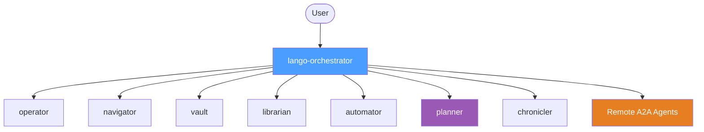

# Multi-Agent Orchestration

When `agent.multiAgent` is enabled, Lango replaces the single monolithic agent with a hierarchical agent tree. An orchestrator delegates tasks to specialized sub-agents based on keyword matching and a structured decision protocol.

## Architecture



The **orchestrator** has no tools of its own. It receives user messages, classifies them, and transfers execution to the appropriate sub-agent via `transfer_to_agent`.

## Sub-Agent Roles

| Agent | Role | Tool Prefixes |
|---|---|---|
| **operator** | System operations: shell commands, file I/O, skill execution | `exec_*`, `fs_*`, `skill_*` |
| **navigator** | Web browsing: page navigation, interaction, screenshots | `browser_*` |
| **vault** | Security: encryption, secret management, blockchain payments | `crypto_*`, `secrets_*`, `payment_*` |
| **librarian** | Knowledge: search, RAG, graph traversal, skill management, learning data, proactive knowledge extraction | `search_*`, `rag_*`, `graph_*`, `save_knowledge`, `save_learning`, `learning_*`, `create_skill`, `list_skills`, `import_skill`, `librarian_*` |
| **automator** | Automation: cron scheduling, background tasks, workflow pipelines | `cron_*`, `bg_*`, `workflow_*` |
| **planner** | Task decomposition and planning (LLM reasoning only, no tools) | _(none)_ |
| **chronicler** | Conversational memory: observations, reflections, recall | `memory_*`, `observe_*`, `reflect_*` |

### Agent Details

#### operator

Executes system-level operations. Handles shell commands, file read/write, and skill invocation. Reports raw results including exit codes.

**Cannot**: web browsing, cryptographic operations, payment transactions, knowledge search, memory management.

#### navigator

Browses the web. Navigates to pages, interacts with elements (click, type, scroll), and takes screenshots. Returns page content with current URL and title.

**Cannot**: shell commands, file operations, cryptographic operations, payment transactions, knowledge search.

#### vault

Handles security-sensitive operations. Encrypts/decrypts data, manages secrets and passwords, signs/verifies, and processes blockchain payments (USDC on Base).

**Cannot**: shell commands, web browsing, file operations, knowledge search, memory management.

#### librarian

Manages the knowledge layer. Searches information, queries RAG indexes, traverses the knowledge graph, saves knowledge and learnings, manages skills, and handles proactive knowledge inquiries. See [Proactive Librarian](librarian.md) for details on the inquiry system.

**Cannot**: shell commands, web browsing, cryptographic operations, memory management (observations/reflections).

#### automator

Manages automation systems. Schedules recurring cron jobs, submits background tasks, and runs multi-step workflow pipelines.

**Cannot**: shell commands, file operations, web browsing, cryptographic operations, knowledge search.

#### planner

Decomposes complex tasks into clear, actionable steps and designs execution plans. Uses LLM reasoning only -- has no tools. This agent is **always included** in the agent tree even when no tools match its prefix.

**Cannot**: executing commands, web browsing, file operations, any tool-based operations.

#### chronicler

Manages conversational memory. Records observations, creates reflections, and recalls past interactions. Returns memories with context and timestamps.

**Cannot**: shell commands, web browsing, file operations, knowledge search, cryptographic operations.

## Tool Partitioning

Tools are assigned to sub-agents based on their name prefix. The matching order is:

1. **librarian** -- checked first because `save_knowledge`, `save_learning`, `create_skill`, and `list_skills` are exact-match prefixes that must not fall through to operator
2. **chronicler** -- `memory_*`, `observe_*`, `reflect_*`
3. **automator** -- `cron_*`, `bg_*`, `workflow_*`
4. **navigator** -- `browser_*`
5. **vault** -- `crypto_*`, `secrets_*`, `payment_*`
6. **operator** -- `exec_*`, `fs_*`, `skill_*`
7. **unmatched** -- tools matching no prefix are tracked separately and listed in the orchestrator prompt

Sub-agents with no matching tools are skipped (not created), except for the **planner** which is always included.

## Routing Protocol

The orchestrator follows a 5-step decision protocol before delegating:

```
1. CLASSIFY  -- Identify the domain of the request
2. MATCH     -- Compare keywords against the routing table
3. SELECT    -- Choose the best-matching agent
4. VERIFY    -- Check the selected agent's "Cannot" list for conflicts
5. DELEGATE  -- Transfer to the selected agent via transfer_to_agent
```

Each sub-agent has a keyword list used for routing:

| Agent | Keywords |
|---|---|
| operator | run, execute, command, shell, file, read, write, edit, delete, skill |
| navigator | browse, web, url, page, navigate, click, screenshot, website |
| vault | encrypt, decrypt, sign, hash, secret, password, payment, wallet, USDC |
| librarian | search, find, lookup, knowledge, learning, retrieve, graph, RAG, inquiry, question, gap |
| automator | schedule, cron, every, recurring, background, async, later, workflow, pipeline, automate, timer |
| planner | plan, decompose, steps, strategy, how to, break down |
| chronicler | remember, recall, observation, reflection, memory, history |

### Rejection Handling

Sub-agents can reject misrouted tasks by responding with:

```
[REJECT] This task requires <correct_agent>. I handle: <capability list>.
```

When a rejection occurs, the orchestrator re-evaluates and tries the next most relevant agent.

### Delegation Limits

The orchestrator enforces a maximum number of delegation rounds per user turn (default: **10**). Simple conversational messages (greetings, opinions, general knowledge) are handled directly by the orchestrator without delegation.

## Remote A2A Agents

When [A2A protocol](a2a-protocol.md) is enabled, remote agents are appended to the sub-agent list and appear in the routing table. The orchestrator can delegate to them just like local sub-agents.

## Custom Agent Definitions

In addition to the built-in agents (operator, navigator, vault, librarian, automator, planner, chronicler), you can define custom agents using `AGENT.md` files.

### AGENT.md Format

Place agent definitions in the directory specified by `agent.agentsDir`. Each agent is a subdirectory containing an `AGENT.md` file:

```
~/.lango/agents/
├── code-reviewer/
│   └── AGENT.md
├── translator/
│   └── AGENT.md
└── data-analyst/
    └── AGENT.md
```

An `AGENT.md` file defines the agent's metadata and behavior:

```markdown
---
name: code-reviewer
description: Reviews code for quality, security, and best practices
prefixes:
  - review_*
  - lint_*
keywords:
  - review
  - code quality
  - security audit
capabilities:
  - code-review
  - security-analysis
---

You are a code review specialist. Analyze code for...
```

The front matter specifies routing metadata (prefixes, keywords, capabilities), while the body becomes the agent's system instruction.

### Loading Priority

1. **Built-in agents** — Always loaded first (operator, navigator, etc.)
2. **User-defined agents** — Loaded from `agent.agentsDir`, merged into the agent tree
3. **Remote A2A agents** — Appended when A2A protocol is enabled

User-defined agents cannot override built-in agent names.

## Dynamic Tool Routing

Tool routing uses a multi-signal matching strategy beyond simple prefix matching:

1. **Prefix match** — Tools are assigned to agents whose prefix patterns match the tool name (e.g., `browser_*` → navigator)
2. **Keyword match** — The orchestrator uses keyword affinity to route ambiguous requests
3. **Capability match** — Custom agents declare capabilities that are matched against task requirements

The `PartitionToolsDynamic` function handles this multi-signal assignment, building a `DynamicToolSet` that maps each agent to its allocated tools. Unmatched tools are tracked separately and listed in the orchestrator's prompt for manual routing.

## Agent Memory

When `agentMemory.enabled` is `true`, each sub-agent maintains its own persistent memory store. This enables:

- **Cross-session learning** — Agents retain context from previous interactions
- **Experience accumulation** — Patterns and preferences are remembered across conversations
- **Per-agent isolation** — Each agent's memory is scoped to its name, preventing cross-contamination

Agent memory is backed by the same storage layer as the main session store and supports search, pruning, and use-count tracking.

## Child Session Isolation

Sub-agents operate in isolated child sessions forked from the parent conversation. This provides:

- **Context isolation** — Each sub-agent sees only its relevant context, not the full conversation history
- **Result merging** — When a sub-agent completes, its results are summarized and merged back into the parent session
- **Cleanup** — Discarded child sessions are cleaned up automatically

The `ChildSessionServiceAdapter` manages the fork/merge lifecycle. A `Summarizer` extracts the key results from the child session before merging.

## Configuration

> **Settings:** `lango settings` → Multi-Agent

```json
{
  "agent": {
    "multiAgent": true
  }
}
```

| Setting | Default | Description |
|---|---|---|
| `agent.multiAgent` | `false` | Enable hierarchical sub-agent orchestration |
| `agent.maxDelegationRounds` | `10` | Max orchestrator→sub-agent delegation rounds per turn |
| `agent.agentsDir` | `""` | Directory containing user-defined AGENT.md agent definitions |

!!! info

    When `multiAgent` is `false` (default), a single monolithic agent handles all tasks with all tools. The multi-agent mode trades some latency (orchestrator reasoning + delegation) for better task specialization and reduced context pollution.

## Agent Registry

The `AgentRegistry` manages agent definitions from multiple sources with a priority-based loading system.

### Registry Sources

| Source | Priority | Description |
|--------|----------|-------------|
| `SourceBuiltin` | 0 | Hardcoded agents (operator, navigator, vault, etc.) |
| `SourceEmbedded` | 1 | Default agents from `embed.FS` (bundled `defaults/` directory) |
| `SourceUser` | 2 | User-defined agents from `~/.lango/agents/` |
| `SourceRemote` | 3 | Agents loaded from P2P network |

The registry provides thread-safe concurrent access (`sync.RWMutex`) and supports:
- `Register(def)` — Add or overwrite an agent definition
- `Get(name)` — Retrieve a specific agent
- `Active()` — Return all agents with `status: active`, sorted by name
- `All()` — Return all agents in insertion order
- `Specs()` — Convert active agents to orchestration format
- `LoadFromStore(store)` — Bulk load from a `Store` implementation

### File Store

The `FileStore` loads agent definitions from a directory. Each agent resides in a subdirectory containing an `AGENT.md` file. See [AGENT.md File Format](agent-format.md) for the file specification.

### Embedded Store

The `EmbeddedStore` loads default agent definitions bundled in the binary via Go's `embed.FS`. These serve as fallback definitions when no user-defined agents are present.

## Tool Hooks

Tool hooks provide a middleware chain for tool execution, enabling cross-cutting concerns like security filtering, access control, and learning.

### Middleware Chain

Tools pass through a middleware chain before and after execution:

```
Request ──► SecurityFilter ──► ApprovalGate ──► Execute ──► LearningObserver ──► KnowledgeSaver ──► EventPublisher ──► Response
```

### Hook Types

| Hook | Phase | Description |
|------|-------|-------------|
| `SecurityFilter` | Pre-execute | Filters dangerous tools and applies PII redaction |
| `ApprovalGate` | Pre-execute | Routes to the approval system for sensitive tools |
| `LearningObserver` | Post-execute | Records tool results for the learning engine |
| `KnowledgeSaver` | Post-execute | Saves extracted knowledge to the knowledge store |
| `EventPublisher` | Post-execute | Publishes tool events to the event bus |
| `BrowserRecovery` | Post-execute | Handles browser tool error recovery |

### Configuration

Hooks are automatically wired based on enabled features:
- Learning hooks require `knowledge.enabled: true`
- Approval hooks require `security.interceptor.enabled: true`
- Event hooks require the event bus to be initialized

## CLI Commands

### Agent Status

```bash
lango agent status
```

Shows whether multi-agent mode is enabled, the orchestrator name, and the number of active sub-agents.

### Agent List

```bash
lango agent list
```

Lists all active sub-agents with their roles, tool counts, and capabilities.

### Agent Tools

```bash
lango agent tools
```

Shows tool-to-agent assignments in multi-agent mode.

### Agent Hooks

```bash
lango agent hooks
```

Shows registered tool hooks in the middleware chain.
