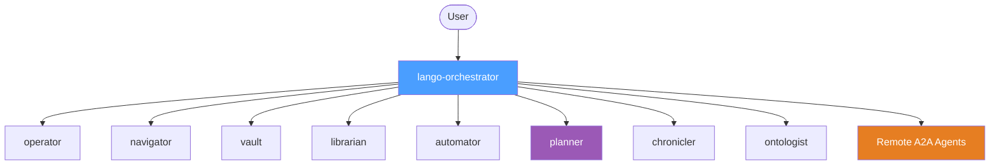

# Multi-Agent Orchestration

When `agent.multiAgent` is enabled and the background submit path is also enabled, Lango runs built-in teammate production work through the dynamic in-process teammate runtime (`dynamic-v1`). The production model-facing control surface for that path is `agent_spawn`, `agent_wait`, and `agent_stop`.

The older `transfer_to_agent` path still exists, but it is now a compatibility route for remote A2A and tightly documented legacy interoperability boundaries. It is not the production path for built-in teammate execution.

## Runtime Model

- `agent_spawn` creates an inspectable `AgentRun` for the new teammate run.
- `agent_wait` observes that run until it reaches a terminal state, or reports a non-terminal timeout view when it is still waiting.
- `agent_stop` cancels a spawned run through the existing run store path.
- `transfer_to_agent` remains available only for remote routing and tightly documented legacy compatibility.

## Architecture


```mermaid
graph TD
    User([User]) --> O[lango-orchestrator]
    O --> OP[operator]
    O --> NAV[navigator]
    O --> V[vault]
    O --> LIB[librarian]
    O --> AUTO[automator]
    O --> PLAN[planner]
    O --> CHR[chronicler]
    O --> ONT[ontologist]
    O --> RA[Remote A2A Agents]

    style O fill:#4a9eff,color:#fff
    style PLAN fill:#9b59b6,color:#fff
    style RA fill:#e67e22,color:#fff
```

The root runtime can still classify requests across the built-in specialist types shown above, but built-in production teammate work uses `agent_spawn` rather than static built-in handoff. The built-in teammate registry remains `operator`, `navigator`, `vault`, `librarian`, `automator`, `planner`, `chronicler`, and `ontologist`.

In production, those built-in teammate types are routing targets, not attached ADK sub-agents. The orchestrator's actual ADK `SubAgents` list is reserved for remote A2A agents and explicit non-built-in compatibility specs.

## Sub-Agent Roles

| Agent | Role | Tool Prefixes |
|---|---|---|
| **operator** | System operations: shell commands, file I/O, skill execution | `exec_*`, `fs_*`, `skill_*` |
| **navigator** | Web browsing: bounded search, page navigation, structured extraction, interaction, screenshots | `browser_*` |
| **vault** | Security: encryption, secret management, blockchain payments | `crypto_*`, `secrets_*`, `payment_*` |
| **librarian** | Knowledge: search, RAG, graph traversal, skill management, learning data, proactive knowledge extraction | `search_*`, `rag_*`, `graph_*`, `save_knowledge`, `save_learning`, `learning_*`, `create_skill`, `list_skills`, `import_skill`, `librarian_*` |
| **automator** | Automation: cron scheduling, background tasks, workflow pipelines | `cron_*`, `bg_*`, `workflow_*` |
| **planner** | Task decomposition and planning (LLM reasoning only, no tools) | _(none)_ |
| **chronicler** | Conversational memory: observations, reflections, recall | `memory_*`, `observe_*`, `reflect_*` |
| **ontologist** | Knowledge ontology management: types, entities, facts, conflicts, and data ingestion | `ontology_*` |

### Agent Details

#### operator

Executes system-level operations. Handles shell commands, file read/write, and skill invocation. Reports raw results including exit codes.

**Cannot**: web browsing, cryptographic operations, payment transactions, knowledge search, memory management.

#### navigator

Browses the web. Runs browser-native searches, navigates to pages, observes actionable elements, extracts structured page content, and takes screenshots. For topic queries it searches once, works from the current results page, and only reformulates once when the first search is empty or clearly irrelevant. Returns structured page/search data with current URL and title when relevant.

**Cannot**: shell commands, file operations, cryptographic operations, payment transactions, knowledge search.

#### vault

Handles security-sensitive operations. Encrypts/decrypts data, manages secrets and passwords, signs/verifies, and processes blockchain payments (USDC on Base).

**Cannot**: shell commands, web browsing, file operations, knowledge search, memory management.

#### librarian

Manages the knowledge layer. Searches information, queries RAG indexes, traverses the knowledge graph, saves knowledge and learnings, manages skills, and handles proactive knowledge inquiries. See [Proactive Librarian](librarian.md) for details on the inquiry system.

**Cannot**: shell commands, web browsing, cryptographic operations, memory management (observations/reflections).

#### automator

Manages automation systems. Schedules recurring cron jobs, submits background tasks, and runs multi-step workflow pipelines.

**Cannot**: shell commands, file operations, web browsing, cryptographic operations, knowledge search.

#### planner

Decomposes complex tasks into clear, actionable steps and designs execution plans. Uses LLM reasoning only -- has no tools. This agent is **always included** in the agent tree even when no tools match its prefix.

**Cannot**: executing commands, web browsing, file operations, any tool-based operations.

#### chronicler

Manages conversational memory. Records observations, creates reflections, and recalls past interactions. Returns memories with context and timestamps.

**Cannot**: shell commands, web browsing, file operations, knowledge search, cryptographic operations.

#### ontologist

Manages the knowledge ontology. Defines and maintains types, entities, facts, and relationships. Detects and resolves conflicts. Handles data ingestion into the ontology layer.

**Cannot**: shell commands, web browsing, file operations, cryptographic operations, memory management.

## Tool Partitioning

Tools are assigned to built-in teammate roles based on their name prefix. Those partitions define default affinity and role maximum scope, not a fixed per-run allowlist. Spawn-time `allowed_tools` can narrow a built-in teammate to a smaller set, but it cannot expand beyond the role max scope.

The matching order is:

1. **librarian** -- checked first because `save_knowledge`, `save_learning`, `create_skill`, and `list_skills` are exact-match prefixes that must not fall through to operator
2. **chronicler** -- `memory_*`, `observe_*`, `reflect_*`
3. **automator** -- `cron_*`, `bg_*`, `workflow_*`
4. **navigator** -- `browser_*`
5. **vault** -- `crypto_*`, `secrets_*`, `payment_*`
6. **ontologist** -- `ontology_*`
7. **operator** -- `exec_*`, `fs_*`, `skill_*`
8. **unmatched** -- tools matching no prefix are tracked separately and listed in the orchestrator prompt

Sub-agents with no matching tools are skipped (not created), except for the **planner** which is always included.

Role max scope is enforced before spawn-time `allowed_tools`. Runtime capability escalation can request additional tools only when the blocked tool is still inside that role max scope.

## Control Plane Tools

### `agent_spawn`

`agent_spawn` creates an inspectable `AgentRun`. Current projections include the requested teammate type, `spawn_reason`, and the spawn-time `allowed_tools` list. When child-session isolation is active for the selected built-in teammate, the run also carries the child session key used for isolated execution.

### `agent_wait`

`agent_wait` returns terminal results for completed, failed, or cancelled runs. On timeout, it keeps the run non-terminal and returns the current projected state. For approval-blocked runs, a timeout continues to report the projected blocked condition instead of coercing the run into failure.

For built-in teammate approval blocking, `grant_request_id` identifies the stable logical blocked request for a given `(run, tool)`. If the same request is surfaced again later during the same active blocked cycle, the request ID stays stable and renewed-attempt semantics appear through separate metadata such as `grant_attempt` and `grant_state`.

When `runLedger.enabled: true` and `runLedger.writeThrough: true` are both active, approval-blocked built-in teammate runs also mirror their latest blocked condition into RunLedger. That durable mirror is best effort and exists for later inspection or replay; the live `agent_wait` path still reads the in-memory `AgentRun` projection first.

### `agent_stop`

`agent_stop` cancels a spawned teammate through the existing run store cancellation path.

## Routing Protocol

The root runtime follows a 5-step decision protocol before choosing a teammate path:

```
1. CLASSIFY  -- Identify the domain of the request
2. MATCH     -- Compare keywords against the routing table
3. SELECT    -- Choose the best-matching teammate type or remote path
4. SCOPE     -- Apply role max scope and any spawn-time `allowed_tools`
5. EXECUTE   -- Built-in teammate work must use `agent_spawn`; use `transfer_to_agent` only for remote A2A or tightly documented legacy compatibility paths
```

Each sub-agent has a keyword list used for routing:

| Agent | Keywords |
|---|---|
| operator | run, execute, command, shell, file, read, write, edit, delete, skill |
| navigator | browse, web, url, page, navigate, click, screenshot, website |
| vault | encrypt, decrypt, sign, hash, secret, password, payment, wallet, USDC |
| librarian | search, find, lookup, knowledge, learning, retrieve, graph, RAG, inquiry, question, gap |
| automator | schedule, cron, every, recurring, background, async, later, workflow, pipeline, automate, timer |
| planner | plan, decompose, steps, strategy, how to, break down |
| chronicler | remember, recall, observation, reflection, memory, history |
| ontologist | ontology, type, entity, fact, conflict, ingest, schema, taxonomy |

### Rejection Handling

Built-in teammates do not emit textual rejection markers. When a task is out of scope, they produce a short visible escalation sentence, end the turn, and return control to the root runtime for re-evaluation using only evidence gathered in the current turn. Remote or legacy compatibility paths may still use `transfer_to_agent` where explicitly documented.

### Completion Contract

Successful tool execution is not enough on its own. A specialist turn is only considered complete when it ends in one of the following:

- A visible assistant response summarizing the result
- A short visible escalation summary that returns control to the root runtime
- A remote/legacy `transfer_to_agent` handoff where that compatibility path is still active
- A structured runtime outcome such as `loop_detected`, `empty_after_tool_use`, or `timeout`

This prevents "tool-only" specialist turns from being treated as silent success.

### Delegation Limits

The orchestrator enforces a maximum number of delegation rounds per user turn (default: **10**). Simple conversational messages (greetings, opinions, general knowledge) are handled directly by the orchestrator without delegation. Delegation activity also extends the active request so specialist handoffs do not look idle to the timeout system.

## Remote A2A Agents

When [A2A protocol](a2a-protocol.md) is enabled, remote agents are appended to the sub-agent list and appear in the routing table. The current remote path continues to use the existing compatibility behavior; `transfer_to_agent` remains the legacy bridge for those paths. This remote compatibility path is separate from the built-in `agent_spawn` runtime path and does not restore built-in production delegation through `transfer_to_agent`.

## Custom Agent Definitions

In addition to the built-in agents (operator, navigator, vault, librarian, automator, planner, chronicler, ontologist), you can define custom agents using `AGENT.md` files.

### AGENT.md Format

Place agent definitions in the directory specified by `agent.agentsDir`. Each agent is a subdirectory containing an `AGENT.md` file:

```
~/.lango/agents/
├── code-reviewer/
│   └── AGENT.md
├── translator/
│   └── AGENT.md
└── data-analyst/
    └── AGENT.md
```

An `AGENT.md` file defines the agent's metadata and behavior:

```markdown
---
name: code-reviewer
description: Reviews code for quality, security, and best practices
prefixes:
  - review_*
  - lint_*
keywords:
  - review
  - code quality
  - security audit
capabilities:
  - code-review
  - security-analysis
---

You are a code review specialist. Analyze code for...
```

The front matter specifies routing metadata (prefixes, keywords, capabilities), while the body becomes the agent's system instruction.

### Loading Priority

1. **Built-in agents** — Always loaded first (operator, navigator, etc.)
2. **User-defined agents** — Loaded from `agent.agentsDir`, merged into the agent tree
3. **Remote A2A agents** — Appended when A2A protocol is enabled

User-defined agents cannot override built-in agent names.

## Dynamic Tool Routing

Tool routing uses a multi-signal matching strategy beyond simple prefix matching:

1. **Prefix match** — Tools are assigned to agents whose prefix patterns match the tool name (e.g., `browser_*` → navigator)
2. **Keyword match** — The orchestrator uses keyword affinity to route ambiguous requests
3. **Capability match** — Custom agents declare capabilities that are matched against task requirements

The `PartitionToolsDynamic` function handles this multi-signal assignment, building a `DynamicToolSet` that maps each agent to its allocated tools. Unmatched tools are tracked separately and listed in the orchestrator's prompt for manual routing.

## Agent Memory

When `agentMemory.enabled` is `true`, each sub-agent maintains its own persistent memory store. This enables:

- **Cross-session learning** — Agents retain context from previous interactions
- **Experience accumulation** — Patterns and preferences are remembered across conversations
- **Per-agent isolation** — Each agent's memory is scoped to its name, preventing cross-contamination

Agent memory is backed by the same storage layer as the main session store and supports search, pruning, and use-count tracking.

## Child Session Isolation

Sub-agents operate in isolated child sessions forked from the parent conversation. This provides:

- **Cross-turn isolation** — Raw sub-agent turns do not persist into the parent conversation history for later turns
- **Same-run continuity** — During the active run, tool calls and tool results remain visible through the parent in-memory view so the sub-agent can continue the ADK loop correctly
- **Result merging** — When a sub-agent completes, its results are summarized and merged back into the parent session
- **Cleanup** — Discarded child sessions are cleaned up automatically

The `ChildSessionServiceAdapter` manages the fork/merge lifecycle. A `Summarizer` extracts the key results from the child session before merging, and discarded child runs leave a compact root-authored failure note instead of raw child history. Child-session routing is enabled by the isolation setting itself; it no longer depends on provenance wiring being present.

Streaming failure paths use the same discard contract as collection-based failures. If an isolated specialist fails mid-turn, the runtime removes the stale child overlay before retrying and closes any dangling parent-visible tool-call state so later retries do not inherit orphaned specialist calls.

Built-in specialist agents such as `operator`, `navigator`, `vault`, `librarian`, `automator`, and `ontologist` use child-session routing by default. `planner` and `chronicler` remain on the parent-session path.

## Turn Traces And Diagnostics

Every multi-agent turn records a durable trace with delegation, tool-call, tool-result, recovery-attempt, and final outcome events. Recent failed traces and isolation leaks are surfaced through `lango doctor` so operators can inspect `loop_detected`, `empty_after_tool_use`, reroute attempts, and similar runtime failures without reading raw logs first.

When structured orchestration is enabled, recovery distinguishes between failures that happen before specialist delegation and failures that happen after a specialist handoff. Post-handoff tool failures generate a reroute hint that names the failed specialist and tells the orchestrator to try a different specialist or answer directly instead of blindly replaying the same specialist path.

## Configuration

> **Settings:** `lango settings` → Multi-Agent

```json
{
  "agent": {
    "multiAgent": true
  }
}
```

| Setting | Default | Description |
|---|---|---|
| `agent.multiAgent` | `false` | Enable hierarchical sub-agent orchestration |
| `agent.maxDelegationRounds` | `10` | Max orchestrator→sub-agent delegation rounds per turn |
| `agent.agentsDir` | `""` | Directory containing user-defined AGENT.md agent definitions |

!!! info

    When `multiAgent` is `false` (default), a single monolithic agent handles all tasks with all tools. The multi-agent mode trades some latency (orchestrator reasoning + delegation) for better task specialization and reduced context pollution.

## Agent Registry

The `AgentRegistry` manages agent definitions from multiple sources with a priority-based loading system.

### Registry Sources

| Source | Priority | Description |
|--------|----------|-------------|
| `SourceBuiltin` | 0 | Hardcoded agents (operator, navigator, vault, etc.) |
| `SourceEmbedded` | 1 | Default agents from `embed.FS` (bundled `defaults/` directory) |
| `SourceUser` | 2 | User-defined agents from `~/.lango/agents/` |
| `SourceRemote` | 3 | Agents loaded from P2P network |

The registry provides thread-safe concurrent access (`sync.RWMutex`) and supports:
- `Register(def)` — Add or overwrite an agent definition
- `Get(name)` — Retrieve a specific agent
- `Active()` — Return all agents with `status: active`, sorted by name
- `All()` — Return all agents in insertion order
- `Specs()` — Convert active agents to orchestration format
- `LoadFromStore(store)` — Bulk load from a `Store` implementation

### File Store

The `FileStore` loads agent definitions from a directory. Each agent resides in a subdirectory containing an `AGENT.md` file. See [AGENT.md File Format](agent-format.md) for the file specification.

### Embedded Store

The `EmbeddedStore` loads default agent definitions bundled in the binary via Go's `embed.FS`. These serve as fallback definitions when no user-defined agents are present.

## Tool Hooks

Tool hooks provide a middleware chain for tool execution, enabling cross-cutting concerns like security filtering, access control, and learning.

### Middleware Chain

Tools pass through a middleware chain before and after execution:

```
Request ──► SecurityFilter ──► ApprovalGate ──► Execute ──► LearningObserver ──► KnowledgeSaver ──► EventPublisher ──► Response
```

### Hook Types

| Hook | Phase | Description |
|------|-------|-------------|
| `SecurityFilter` | Pre-execute | Filters dangerous tools and applies PII redaction |
| `ApprovalGate` | Pre-execute | Routes to the approval system for sensitive tools |
| `LearningObserver` | Post-execute | Records tool results for the learning engine |
| `KnowledgeSaver` | Post-execute | Saves extracted knowledge to the knowledge store |
| `EventPublisher` | Post-execute | Publishes tool events to the event bus |
| `BrowserRecovery` | Post-execute | Handles browser tool error recovery |

### Configuration

Hooks are automatically wired based on enabled features:
- Learning hooks require `knowledge.enabled: true`
- Approval hooks require `security.interceptor.enabled: true`
- Event hooks require the event bus to be initialized

## P2P Team Coordination

When P2P networking is enabled, agents can form dynamic, task-scoped teams across the network. The team coordination system is implemented in `internal/p2p/team/`.

### Team Lifecycle

A team follows a four-state lifecycle:

```
Forming ──► Active ──► Completed
                  └──► Disbanded
```

| Status | Description |
|--------|-------------|
| `forming` | Team is being assembled from the agent pool |
| `active` | Team is executing tasks |
| `completed` | Team goal has been achieved |
| `disbanded` | Team has been dissolved |

### Member Roles

Each team member is assigned a role that determines their responsibilities:

| Role | Description |
|------|-------------|
| `leader` | Coordinates the team, assigns tasks, reviews results |
| `worker` | Executes delegated tasks |
| `reviewer` | Reviews work output from other members |
| `observer` | Monitors team progress without active participation |

### Team Formation

The `Coordinator` forms teams by selecting agents from the `agentpool.Pool` based on capability matching:

1. The leader agent is added from the pool by DID
2. Worker agents are selected via `Selector.SelectN()` filtered by required capability
3. The team transitions to `active` status
4. `TeamMemberJoinedEvent` is published for each member via the event bus

### Task Delegation

Tasks are delegated to all worker members concurrently. Each worker receives a `ScopedContext` carrying the team ID, member DID, and role so downstream handlers can identify the execution context.

Results are collected from all workers and passed through a conflict resolver to produce the final output.

### Conflict Resolution

When multiple workers produce different results, a conflict resolution strategy determines the final output:

| Strategy | Behavior |
|----------|----------|
| `trust_weighted` | Picks the result from the fastest successful agent (proxy for trust) |
| `majority_vote` | Picks the most common successful result |
| `leader_decides` | Returns the first successful result for leader review |
| `fail_on_conflict` | Fails if more than one distinct successful result exists |

### Payment Negotiation

The `Negotiator` handles payment terms between team leaders and members. Payment mode is selected based on trust score:

| Mode | Condition | Description |
|------|-----------|-------------|
| `free` | Price is zero | No payment required |
| `postpay` | Trust score >= 0.8 | Pay after task completion |
| `prepay` | Trust score < 0.8 | Pay before task execution |

Payment agreements track per-use pricing, currency (USDC), maximum uses, and validity windows.

### Context Filtering

The `ContextFilter` controls which metadata is shared with team members. It supports allow-list and exclude-list patterns to prevent sensitive data from leaking across team boundaries.

### Team Events

The event bus publishes lifecycle events for team operations:

| Event | Description |
|-------|-------------|
| `team.formed` | A new team was created |
| `team.disbanded` | A team was dissolved |
| `team.member.joined` | An agent joined a team |
| `team.member.left` | An agent left a team |
| `team.task.delegated` | A task was sent to workers |
| `team.task.completed` | A delegated task finished |
| `team.conflict.detected` | Conflicting results were found |
| `team.payment.agreed` | Payment terms were negotiated |
| `team.health.check` | A team health sweep completed |
| `team.leader.changed` | The team leader was replaced |

## P2P Agent Pool

The `agentpool` package manages discovered P2P agents with health tracking, weighted selection, and capability-based filtering.

### Agent Health Status

Each pooled agent has a health status derived from heartbeats and invocation success rates:

| Status | Description |
|--------|-------------|
| `healthy` | Agent is responding normally |
| `degraded` | Agent is slow or has elevated error rates |
| `unhealthy` | Agent is not responding |
| `unknown` | No health data available yet |

### Performance Tracking

The pool tracks runtime performance metrics per agent:

- **Average latency** (milliseconds)
- **Success rate** (0.0 - 1.0)
- **Total call count**
- **Trust score** and **price per call**
- **Last seen** and **last healthy** timestamps
- **Consecutive failure count**

### Agent Selection

The `Selector` chooses agents for team formation using capability matching and trust-weighted scoring. `SelectN(capability, count)` returns the top N agents that advertise the requested capability.

## CLI Commands

### Agent Status

```bash
lango agent status
```

Shows the current agent mode, provider/model, A2A/P2P/hook status, registry counts, and `Teammate Runtime: dynamic-v1` when the built-in teammate runtime path is configured and `background.enabled` is also enabled. If `agent.multiAgent` is enabled without `background.enabled`, the status output keeps the runtime unavailable and prints a hint telling you to enable `background.enabled`.

### Agent List

```bash
lango agent list
```

Lists registered agent definitions from the agent registry. It does not show live spawned teammate runs.

### Agent Tools

```bash
lango agent tools
```

Shows tool-to-agent assignments in multi-agent mode.

### Agent Hooks

```bash
lango agent hooks
```

Shows registered tool hooks in the middleware chain.
