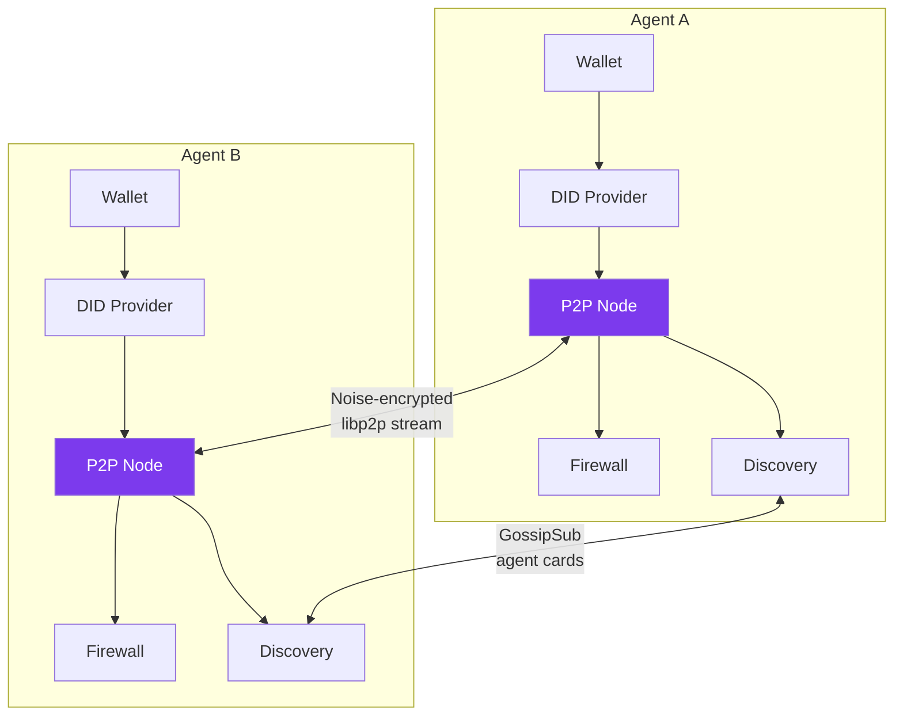
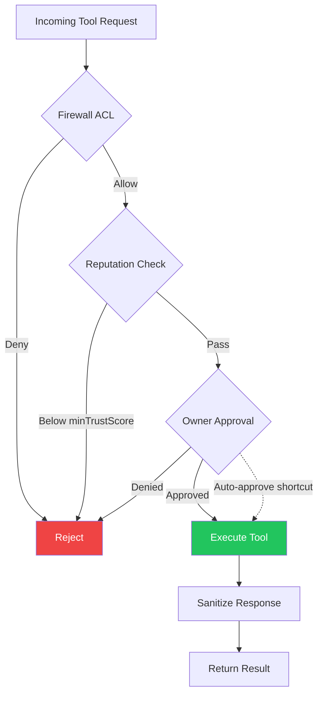
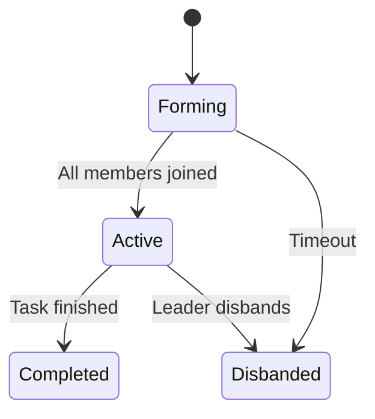

# P2P Network

!!! warning "Experimental"

    The P2P networking system is experimental. The protocol and configuration may change in future releases.

Lango supports decentralized agent-to-agent connectivity via libp2p. The Sovereign Agent Network (SAN) enables peer-to-peer communication with DID-based identity, zero-knowledge enhanced handshake, and a knowledge firewall for access control.

## Overview

The P2P subsystem enables direct agent communication without centralized coordination:

- **Direct connectivity** -- agents connect peer-to-peer using libp2p with Noise encryption
- **DID-based identity** -- each agent can expose either a legacy `did:lango:<hex>` identity or a bundle-backed `did:lango:v2:<hash>` identity
- **Knowledge firewall** -- default deny-all ACL controls which peers can access which tools
- **Agent discovery** -- GossipSub-based agent card propagation for capability-based search
- **ZK-enhanced handshake** -- optional zero-knowledge proof verification during peer authentication



## Identity

Each Lango agent supports two DID forms:

- `did:lango:<hex>` for legacy wallet-derived identities
- `did:lango:v2:<hash>` for bundle-backed identities

The active DID is exposed by the CLI and by `GET /api/p2p/identity` when the local identity provider can resolve one.

The DID is deterministically mapped to a libp2p peer ID, ensuring cryptographic binding between the wallet identity and the network identity. Private keys never leave the wallet layer.

## Handshake

When two agents connect, they perform mutual DID-based authentication:

1. **TCP/QUIC connection** established via libp2p with Noise encryption
2. **DID exchange** -- each peer presents its `did:lango:...` identifier
3. **Signature verification** -- DID public key is verified against the peer ID
4. **Signed challenge** -- the initiating peer sends a challenge with ECDSA signature over the canonical payload (`nonce || timestamp || senderDID`). The receiver validates the signature, checks the timestamp (5-minute past window, 30-second future grace), and verifies the nonce against a TTL-based replay cache.
5. **Session token** -- a time-limited session token is issued for subsequent queries
6. **(Optional) ZK proof** -- when `p2p.zkHandshake` is enabled, a zero-knowledge proof of identity is verified

**Protocol Versioning:**

| Version | Protocol ID | Features |
|---------|------------|----------|
| v1.0 | `/lango/handshake/1.0.0` | Legacy unsigned challenge (backward compatible) |
| v1.1 | `/lango/handshake/1.1.0` | ECDSA signed challenge, timestamp validation, nonce replay protection |

When `p2p.requireSignedChallenge` is `true`, unsigned (v1.0) challenges are rejected. Default is `false` for backward compatibility.

Session tokens have a configurable TTL (`p2p.sessionTokenTtl`). Expired tokens require re-authentication.

## Session Management

Sessions are managed through `SessionStore` with both TTL-based expiration and explicit invalidation.

### Invalidation Reasons

| Reason | Trigger |
|--------|---------|
| `logout` | Peer explicitly logs out |
| `reputation_drop` | Peer reputation drops below `minTrustScore` |
| `repeated_failures` | N consecutive tool execution failures |
| `manual_revoke` | Owner manually revokes via CLI |
| `security_event` | Automatic security event handler |

### Security Event Handler

The `SecurityEventHandler` monitors peer behavior and automatically invalidates sessions when:

- A peer's reputation drops below the configured `minTrustScore`
- A peer exceeds the consecutive failure threshold
- A security event is triggered externally

### CLI

```bash
lango p2p session list                          # List active sessions
lango p2p session revoke --peer-did <did>       # Revoke specific peer
lango p2p session revoke-all                    # Revoke all sessions
```

## Knowledge Firewall

The knowledge firewall enforces access control for peer queries. The default policy is **deny-all** -- explicit rules must be added to allow access.

### ACL Rules

Each rule specifies:

| Field | Description |
|-------|-------------|
| `peerDid` | Peer DID this rule applies to (`"*"` for all peers) |
| `action` | `"allow"` or `"deny"` |
| `tools` | Tool name patterns (supports `*` wildcard, empty = all tools) |
| `rateLimit` | Maximum requests per minute (0 = unlimited) |

### Response Sanitization

All responses to peer queries are automatically sanitized:

- Absolute file paths are redacted
- Sensitive fields (passwords, tokens, private keys) are stripped
- Internal IDs and database paths are removed

### ZK Attestation

When `p2p.zkAttestation` is enabled, responses include a zero-knowledge proof that the response was generated by the claimed agent without revealing internal state.

## Approval Pipeline

Inbound P2P tool invocations pass through a three-stage gate before execution:



### Stage 1: Firewall ACL

The [Knowledge Firewall](#knowledge-firewall) evaluates static allow/deny rules by peer DID and tool name pattern. Requests that don't match any allow rule are rejected immediately.

### Stage 2: Reputation Check

If a reputation checker is configured, the peer's trust score is verified against `minTrustScore` (default: 0.3). New peers with no history (score = 0) are allowed through. Peers with a score above 0 but below the threshold are rejected.

### Stage 3: Owner Approval

The local agent owner is prompted to approve or deny the tool invocation. This stage supports several auto-approval shortcuts:

| Condition | Behavior |
|-----------|----------|
| **Paid tool, price < `autoApproveBelow`** | Auto-approved if within spending limits (`maxPerTx`, `maxDaily`) |
| **`autoApproveKnownPeers: true`** | Previously authenticated peers skip handshake approval |
| **Free tool** | Always requires interactive owner approval |

When auto-approval conditions are not met, the request falls back to the composite approval provider (Telegram inline keyboard, Discord button, Slack interactive message, or terminal prompt).

## Tool Execution Sandbox

Inbound P2P tool invocations can run in an isolated sandbox to prevent malicious tool code from accessing process memory (passphrases, private keys, session tokens).

### Isolation Modes

| Mode | Backend | Isolation Level | Overhead |
|------|---------|----------------|----------|
| **Subprocess** | `os/exec` | Process-level | ~10ms |
| **Container** | Docker SDK | Container-level (namespaces, cgroups) | ~50-100ms |

### Container Runtime Probe Chain

When container mode is enabled, the executor probes available runtimes in order:

1. **Docker** -- Full Docker SDK integration with OOM detection, label-based cleanup (`lango.sandbox=true`)
2. **gVisor** -- Stub for future implementation
3. **Native** -- Falls back to subprocess executor

### Container Pool

An optional pre-warmed container pool reduces cold-start latency. Configure `poolSize` (default: 0 = disabled) and `poolIdleTimeout` (default: 5m).

### Configuration

```json
{
  "p2p": {
    "toolIsolation": {
      "enabled": true,
      "timeoutPerTool": "30s",
      "maxMemoryMB": 512,
      "container": {
        "enabled": true,
        "runtime": "auto",
        "image": "lango-sandbox:latest",
        "networkMode": "none",
        "readOnlyRootfs": true,
        "poolSize": 3
      }
    }
  }
}
```

### CLI

```bash
lango p2p sandbox status    # Show sandbox runtime status
lango p2p sandbox test      # Run smoke test
lango p2p sandbox cleanup   # Remove orphaned containers
```

## Discovery

Agent discovery uses GossipSub for decentralized agent card propagation:

1. Each agent publishes its **Agent Card** periodically on the `/lango/agentcard/1.0.0` topic
2. Cards include: name, description, DID, multiaddrs, capabilities, pricing, and ZK credentials
3. Peers can search for agents by capability tag using `FindByCapability`
4. ZK credentials on cards are verified before acceptance

### Agent Card Structure

```json
{
  "name": "my-agent",
  "description": "Research assistant",
  "did": "did:lango:02abc...",
  "multiaddrs": ["/ip4/1.2.3.4/tcp/9000"],
  "capabilities": ["research", "code-review"],
  "pricing": {
    "currency": "USDC",
    "perQuery": "0.01"
  },
  "peerId": "QmAbc..."
}
```

## Credential Revocation

The gossip discovery system supports credential revocation to prevent compromised or retired agents from being discovered.

### Revocation Mechanisms

- **`RevokeDID(did)`** -- Adds a DID to the local revocation set. Revoked DIDs are rejected during agent card validation.
- **`IsRevoked(did)`** -- Checks whether a DID has been revoked.
- **`maxCredentialAge`** -- Credentials older than this duration (measured from `IssuedAt`) are rejected even if not explicitly revoked.

### Credential Validation

When processing incoming agent cards via GossipSub, three checks are applied:

1. **Expiration** -- `ExpiresAt` must be in the future
2. **Staleness** -- `IssuedAt + maxCredentialAge` must be in the future
3. **Revocation** -- The agent's DID must not be in the revocation set

Configure `maxCredentialAge` in the ZKP settings:

```json
{
  "p2p": {
    "zkp": {
      "maxCredentialAge": "24h"
    }
  }
}
```

## ZK Circuits

When ZK features are enabled, Lango uses four zero-knowledge circuits:

| Circuit | Purpose | Public Inputs |
|---------|---------|---------------|
| Identity | Prove DID ownership without revealing the private key | DID hash |
| Membership | Prove membership in an authorized peer set | Merkle root |
| Range | Prove a value falls within a range (e.g., reputation score) | Min, Max bounds |
| Attestation | Prove response authenticity with freshness guarantees | AgentID hash, MinTimestamp, MaxTimestamp |
| Capability | Prove authorized capability with agent binding | CapabilityHash, AgentTestBinding |

### Attestation Freshness

The Attestation circuit includes `MinTimestamp` and `MaxTimestamp` public inputs with range assertions, ensuring proofs are fresh and cannot be replayed outside the validity window.

### Structured Attestation Data

Attestation proofs are returned as structured `AttestationData`:

```json
{
  "proof": "<base64-encoded-proof>",
  "publicInputs": ["<agent-id-hash>", "<min-ts>", "<max-ts>"],
  "circuitId": "attestation",
  "scheme": "plonk"
}
```

### SRS Configuration

Configure the proving scheme and SRS (Structured Reference String) source:

| Setting | Values | Description |
|---------|--------|-------------|
| `p2p.zkp.provingScheme` | `"plonk"`, `"groth16"` | ZKP proving scheme |
| `p2p.zkp.srsMode` | `"unsafe"`, `"file"` | SRS generation mode |
| `p2p.zkp.srsPath` | file path | Path to SRS file (when `srsMode = "file"`) |

!!! warning "Production SRS"
    The `"unsafe"` SRS mode uses a deterministic setup suitable for development. For production deployments, use `"file"` mode with an SRS generated from a trusted ceremony.

## Configuration

> **Settings:** `lango settings` → P2P Network

```json
{
  "p2p": {
    "enabled": true,
    "listenAddrs": ["/ip4/0.0.0.0/tcp/9000"],
    "bootstrapPeers": [],
    "keyDir": "~/.lango/p2p",
    "enableRelay": false,
    "enableMdns": true,
    "maxPeers": 50,
    "handshakeTimeout": "30s",
    "sessionTokenTtl": "1h",
    "autoApproveKnownPeers": false,
    "firewallRules": [
      {
        "peerDid": "*",
        "action": "allow",
        "tools": ["search_*"],
        "rateLimit": 10
      }
    ],
    "gossipInterval": "30s",
    "zkHandshake": false,
    "zkAttestation": false,
    "requireSignedChallenge": false,
    "zkp": {
      "proofCacheDir": "~/.lango/zkp",
      "provingScheme": "plonk",
      "srsMode": "unsafe",
      "srsPath": "",
      "maxCredentialAge": "24h"
    },
    "toolIsolation": {
      "enabled": false,
      "timeoutPerTool": "30s",
      "maxMemoryMB": 512,
      "container": {
        "enabled": false,
        "runtime": "auto",
        "image": "lango-sandbox:latest",
        "networkMode": "none",
        "poolSize": 0
      }
    },
    "workspace": {
      "enabled": false,
      "dataDir": "~/.lango/workspaces",
      "maxWorkspaces": 10,
      "maxBundleSizeBytes": 0,
      "chroniclerEnabled": false,
      "autoSandbox": false,
      "contributionTracking": false
    }
  }
}
```

See the [Configuration Reference](../configuration.md#p2p-network) for all P2P settings.

## REST API

When the gateway is running (`lango serve`), read-only P2P endpoints are available for monitoring and external integrations:

| Endpoint | Description |
|----------|-------------|
| `GET /api/p2p/status` | Peer ID, listen addresses, connected peer count |
| `GET /api/p2p/peers` | List of connected peers with multiaddresses |
| `GET /api/p2p/identity` | Active DID when available and peer ID |
| `GET /api/p2p/reputation` | Peer trust score and exchange history |
| `GET /api/p2p/pricing` | Tool pricing (single or all tools) |

```bash
# Check node status
curl http://localhost:18789/api/p2p/status

# List connected peers
curl http://localhost:18789/api/p2p/peers

# Get DID identity
curl http://localhost:18789/api/p2p/identity

# Query peer reputation
curl "http://localhost:18789/api/p2p/reputation?peer_did=did:lango:02abc..."

# Get tool pricing
curl http://localhost:18789/api/p2p/pricing
curl "http://localhost:18789/api/p2p/pricing?tool=knowledge_search"
```

These endpoints query the running server's persistent P2P node. They are public only when gateway auth is disabled; when auth is configured, the entire `/api/p2p/*` subtree is protected by gateway auth. See the [HTTP API Reference](../gateway/http-api.md#p2p-network) for response format details.

## CLI Commands

The CLI commands create ephemeral P2P nodes for one-off operations, independent of the running server:

```bash
lango p2p status               # Show node status
lango p2p peers                # List connected peers
lango p2p connect <multiaddr>  # Connect to a peer
lango p2p disconnect <peer-id> # Disconnect from a peer
lango p2p firewall list        # List firewall rules
lango p2p firewall add         # Add a firewall rule
lango p2p discover             # Discover agents
lango p2p identity             # Show local identity and active DID when available
lango p2p reputation --peer-did <did>  # Query trust score
lango p2p pricing              # Show tool pricing
lango p2p session list                          # List active sessions
lango p2p session revoke --peer-did <did>       # Revoke peer session
lango p2p session revoke-all                    # Revoke all sessions
lango p2p sandbox status                        # Show sandbox status
lango p2p sandbox test                          # Run sandbox smoke test
lango p2p sandbox cleanup                       # Remove orphaned containers
lango p2p team list                             # List active P2P teams
lango p2p team status <id>                      # Show team details
lango p2p team disband <id>                     # Disband an active team
lango p2p zkp status                            # Show ZKP configuration
lango p2p zkp circuits                          # List ZKP circuits
lango p2p workspace create <name>               # Create a collaborative workspace
lango p2p workspace list                        # List all workspaces
lango p2p workspace status <id>                 # Show workspace status and members
lango p2p workspace join <id>                   # Join a workspace
lango p2p workspace leave <id>                  # Leave a workspace
lango p2p git init <workspace-id>               # Initialize workspace git repo
lango p2p git log <workspace-id>                # Show workspace commit history
lango p2p git diff <workspace-id> <from> <to>   # Show diff between commits
lango p2p git push <workspace-id>               # Create and push git bundle
lango p2p git fetch <workspace-id>              # Fetch and apply git bundle
```

See the [P2P CLI Reference](../cli/p2p.md) for detailed command documentation.

## Paid Value Exchange

Lango supports paid P2P tool invocations via the **Payment Gate**. When pricing is enabled, remote peers must pay in USDC before invoking tools.

### Payment Gate Flow

1. **Price Query** — The caller queries the provider's pricing via `p2p_price_query` or `GET /api/p2p/pricing`
2. **Price Quote** — The provider returns a `PriceQuoteResult` with the tool price in USDC
3. **Payment** — The caller sends USDC via `p2p_pay` to the provider's wallet address
4. **Tool Invocation** — After payment confirmation, the caller invokes the tool via `p2p_query`

### Auto-Approval for Small Amounts

When `payment.limits.autoApproveBelow` is set, small payments are auto-approved without user confirmation. The auto-approval check evaluates three conditions:

1. **Threshold** — the payment amount is strictly below `autoApproveBelow`
2. **Per-transaction limit** — the amount does not exceed `maxPerTx`
3. **Daily limit** — the cumulative daily spend (including this payment) does not exceed `maxDaily`

If any condition fails, the system falls back to interactive approval via the configured channel (Telegram, Discord, Slack, or terminal).

This applies to both outbound payments (`p2p_pay`, `payment_send`) and inbound paid tool invocations where the owner's approval pipeline checks the tool price against the spending limiter.

### USDC Registry

Payment settlements use on-chain USDC transfers. The system supports multiple chains via the `contracts.LookupUSDC()` registry. Wallet addresses are derived from peer DIDs.

### Configuration

```json
{
  "p2p": {
    "pricing": {
      "enabled": true,
      "perQuery": "0.10",
      "toolPrices": {
        "knowledge_search": "0.25",
        "browser_navigate": "0.50"
      }
    }
  }
}
```

## Trust-Based Pricing Tiers

The pricing system supports differentiated payment flows based on peer reputation:

| Tier | Reputation Score | Payment Flow |
|------|-----------------|--------------|
| **PostPay** | ≥ `postPayMinScore` (default: 0.8) | Tool executes first, payment settles after |
| **PrePay** | < `postPayMinScore` | Payment must confirm before tool execution |

This tiered approach rewards trusted peers with lower friction while protecting against unknown or low-reputation callers.

### Configuration

```json
{
  "p2p": {
    "pricing": {
      "trustThresholds": {
        "postPayMinScore": 0.8
      }
    }
  }
}
```

## Settlement Service

The settlement service handles asynchronous on-chain USDC settlement for P2P tool invocations. It supports EIP-3009 authorization-based transfers for gasless payments.

### Settlement Flow

1. **Trigger** — After a paid tool invocation completes (or before, for PrePay tier)
2. **Build transaction** — Constructs an EIP-3009 `transferWithAuthorization` call
3. **Submit with retry** — Submits the transaction with exponential backoff (up to `maxRetries`)
4. **Wait for confirmation** — Monitors on-chain receipt up to `receiptTimeout`
5. **Record outcome** — Updates reputation (success/failure) via `ReputationRecorder`

### Subscriber Pattern

External components can subscribe to settlement outcomes:

```go
service.Subscribe(func(result SettlementResult) {
    // Handle completed settlement
})
```

### Configuration

```json
{
  "p2p": {
    "pricing": {
      "settlement": {
        "receiptTimeout": "2m",
        "maxRetries": 3
      }
    }
  }
}
```

| Key | Default | Description |
|-----|---------|-------------|
| `p2p.pricing.settlement.receiptTimeout` | `2m` | Max wait for on-chain receipt confirmation |
| `p2p.pricing.settlement.maxRetries` | `3` | Max transaction submission retries |

## Buyer Auto-Payment

The `p2p_invoke_paid` tool automates the complete paid remote tool invocation flow from the buyer side:

1. **Discover** — Find the target agent via DHT or gossip
2. **Query price** — Fetch the tool's USDC price from the provider
3. **Authorize payment** — Sign an EIP-3009 `transferWithAuthorization` for the exact amount
4. **Invoke tool** — Send the tool request with the payment authorization attached
5. **Confirm settlement** — Wait for on-chain confirmation

This tool is automatically available when both P2P and payment features are enabled. It integrates with the spending limiter (`maxPerTx`, `maxDaily`) and auto-approval thresholds.

## P2P Team Coordination

P2P teams enable task-scoped collaboration between multiple agents across the network.

### Team Lifecycle



### Roles

| Role | Description |
|------|-------------|
| **Leader** | Creates the team, assigns tasks, manages budget |
| **Worker** | Executes assigned subtasks |
| **Reviewer** | Validates task outputs |
| **Observer** | Monitors progress without active participation |

### Member Status

Each member tracks their current status: `Idle`, `Busy`, `Failed`, or `Left`.

### Scoped Context

Teams operate with a `ScopedContext` that controls metadata sharing between members. A `ContextFilter` restricts what information flows between agents, preventing unintended data leakage across organizational boundaries.

### Budget Tracking

Teams track cumulative spending via `AddSpend()`. The leader manages the team's budget and can enforce spending limits across all members.

### Conflict Resolution

When multiple team members produce conflicting results for the same task, the coordinator applies a configurable conflict resolution strategy:

| Strategy | Behavior |
|----------|----------|
| `trust_weighted` | Picks the result from the highest-trust (fastest) agent |
| `majority_vote` | Picks the most common result by simple majority |
| `leader_decides` | Returns the first successful result for leader review |
| `fail_on_conflict` | Returns an error if members produce different results |

Source: `internal/p2p/team/conflict.go`

### Assignment Strategies

Task assignment to team members follows one of three strategies:

| Strategy | Behavior |
|----------|----------|
| `best_match` | Assigns to the agent with the highest capability match |
| `round_robin` | Cycles through members evenly |
| `load_balanced` | Assigns to the least-busy member |

Source: `internal/p2p/team/coordinator.go`

### Health Monitoring

The `HealthMonitor` periodically pings team members to detect unresponsive agents. It runs as a lifecycle component alongside the coordinator.

**How it works:**

1. Every `interval` (default: 30s), the monitor sends a `health_ping` to each non-leader member
2. If a member fails to respond, its consecutive miss counter increments
3. When a member reaches `maxMissed` (default: 3) consecutive failures, a `TeamMemberUnhealthyEvent` is published
4. On task completion, all miss counters for the team are reset
5. On team disband, tracking data is cleaned up to prevent memory leaks

| Config Field | Default | Description |
|-------------|---------|-------------|
| `interval` | `30s` | Time between health check sweeps |
| `maxMissed` | `3` | Consecutive missed pings before unhealthy |

**Events:**

| Event | Description |
|-------|-------------|
| `team.member.unhealthy` | Member missed `maxMissed` consecutive pings |
| `team.health.check` | Aggregate health sweep completed (healthy/total counts) |

Source: `internal/p2p/team/health_monitor.go`

### Graceful Shutdown

The `GracefulShutdown` method performs an ordered team shutdown sequence:

1. **Block new tasks** -- Sets team status to `StatusShuttingDown`, preventing new task delegation
2. **Calculate settlement** -- Counts active members with recorded spend for proportional budget settlement
3. **Persist state** -- Saves the shutting-down status to the team store
4. **Publish event** -- Publishes `TeamGracefulShutdownEvent` with `MembersSettled` count
5. **Disband** -- Calls `DisbandTeam` to finalize cleanup

Graceful shutdown is triggered automatically by the **team-shutdown bridge** when a `BudgetExhaustedEvent` fires for the team's task ID. A `TeamBudgetWarningEvent` is also published when the budget crosses the 80% threshold.

| Event | Description |
|-------|-------------|
| `team.graceful.shutdown` | Team shut down with reason and settlement count |
| `team.budget.warning` | Budget crossed 80% threshold (threshold, spent, budget) |

Source: `internal/p2p/team/coordinator_shutdown.go`

### Git State Divergence Detection

The health monitor optionally collects git HEAD hashes from workspace members during health checks. When a `GitStateProvider` is configured, each successful ping is followed by a git state query.

`DetectDivergence(workspaceID)` compares collected HEAD hashes and identifies members whose HEAD differs from the majority:

1. Count the frequency of each HEAD hash across all members
2. Determine the majority HEAD (most common hash)
3. Return a `GitDivergence` for each member whose HEAD differs

When divergence is detected, a `WorkspaceGitDivergenceEvent` is published with the majority HEAD and a list of divergent members.

| Event | Description |
|-------|-------------|
| `workspace.git.divergence` | Members have divergent git HEADs (majority vs divergent list) |

Source: `internal/p2p/team/health_monitor.go`, `internal/eventbus/workspace_events.go`

### Payment Coordination

The `PaymentCoordinator` negotiates payment terms between team leader and members. Payment mode is selected based on trust score:

| Trust Score | Mode | Description |
|-------------|------|-------------|
| Price = 0 | `free` | No payment required |
| >= 0.7 | `postpay` | Tool executes first, payment settles after |
| < 0.7 | `prepay` | Payment must confirm before tool execution |

The `Negotiator` queries each member's tool price and trust score to determine the payment mode. Agreements include `PricePerUse`, `Currency` (USDC), `MaxUses`, and `ValidUntil`.

Source: `internal/p2p/team/payment.go`

### Team Events

The event bus publishes team lifecycle events:

| Event | Description |
|-------|-------------|
| `team.formed` | New team created with leader and initial members |
| `team.disbanded` | Team disbanded with reason |
| `team.member.joined` | Agent joined a team with role |
| `team.member.left` | Agent left a team with reason |
| `team.task.delegated` | Task sent to team workers |
| `team.task.completed` | Delegated task finished with success/failure counts |
| `team.conflict.detected` | Conflicting results found from members |
| `team.payment.agreed` | Payment terms negotiated with member |
| `team.health.check` | Team-level health sweep completed |
| `team.member.unhealthy` | Member missed consecutive health pings |
| `team.budget.warning` | Team budget crossed 80% threshold |
| `team.graceful.shutdown` | Team underwent graceful shutdown with settlement |
| `team.leader.changed` | Team leader replaced |

Source: `internal/eventbus/team_events.go`

## Collaborative Workspaces

Workspaces are collaborative environments where multiple agents share code, messages, and context within a P2P network. Each workspace has a lifecycle, members, and optional features like chronicling and contribution tracking.

### Workspace Lifecycle

| Status | Description |
|--------|-------------|
| `forming` | Workspace created, waiting for members to join |
| `active` | Workspace is active with participating agents |
| `archived` | Workspace completed or disbanded |

### Members and Roles

| Role | Description |
|------|-------------|
| `creator` | Agent that created the workspace |
| `member` | Agent that joined the workspace |

### Message Types

Workspace messages facilitate real-time collaboration:

| Type | Description |
|------|-------------|
| `TASK_PROPOSAL` | Propose a task for workspace members |
| `LOG_STREAM` | Share log output in real-time |
| `COMMIT_SIGNAL` | Signal that code has been committed |
| `KNOWLEDGE_SHARE` | Share knowledge or context |
| `MEMBER_JOINED` | A member joined the workspace |
| `MEMBER_LEFT` | A member left the workspace |

### GossipSub Topics

Workspaces use GossipSub for real-time message distribution:
- Topic per workspace: `/lango/workspace/<workspace-id>`
- Members subscribe on join, unsubscribe on leave

### Chronicler

When `chroniclerEnabled` is true, workspace messages are persisted as graph triples for long-term knowledge retention. Each message generates triples:
- `workspace:message:<id>` → type, workspace, sender, content, timestamp
- Reply chains are linked via `replyTo` predicates

Source: `internal/p2p/workspace/chronicler.go`

### Contribution Tracking

When `contributionTracking` is true, per-agent metrics are collected:
- **Commits**: Number of git commits per member
- **Code Bytes**: Total code contribution size
- **Messages**: Number of workspace messages posted
- **Last Active**: Most recent activity timestamp

Source: `internal/p2p/workspace/contribution.go`

## Git Bundle Exchange

Git bundle exchange enables atomic code sharing between workspace members using bare git repositories and the git bundle protocol.

### Architecture

- **Bare Repo Store**: Each workspace gets an isolated bare git repository at `<dataDir>/<workspaceID>/repo.git`
- **Bundle Protocol**: Uses `git bundle create/unbundle` for transfer (leverages git CLI for reliability)
- **P2P Transport**: Bundles are transferred over the P2P network protocol `/lango/p2p-git/1.0.0`

### Bundle Workflow

1. **Init**: Initialize a bare repo for a workspace (`Service.Init`)
2. **Create Bundle**: Package all refs into a bundle (`Service.CreateBundle`) → returns bytes + HEAD hash
3. **Transfer**: Send bundle over P2P to workspace members
4. **Apply Bundle**: Receiver unbundles into their bare repo (`Service.ApplyBundle`)

### DAG Leaf Detection

`Service.Leaves()` identifies commits with no children — useful for detecting divergent branches and potential merge conflicts across distributed agents.

### Configuration

| Field | Type | Default | Description |
|-------|------|---------|-------------|
| `maxBundleSizeBytes` | int64 | `0` | Maximum bundle size (0 = unlimited) |
| `dataDir` | string | `~/.lango/workspaces` | Base directory for workspace repos |

Source: `internal/p2p/gitbundle/`

## Agent Pool

The agent pool provides discovery, health monitoring, and intelligent selection of P2P agents.

### Health Checking

The `HealthChecker` runs periodic probes against pooled agents:

| Status | Meaning |
|--------|---------|
| `Healthy` | Agent responded within acceptable latency |
| `Degraded` | Agent responding but with elevated latency or error rate |
| `Unhealthy` | Agent unreachable or failing consistently |
| `Unknown` | No health data available (newly discovered) |

Stale agents (no health check response within the eviction window) are automatically removed.

### Weighted Selection

The `Selector` uses configurable weights to score agents:

- **Reputation** — Peer trust score from the reputation system
- **Latency** — Recent response times
- **Success rate** — Historical success/failure ratio
- **Availability** — Current health status

Selection strategies:
- `Select()` — Pick the highest-scoring agent
- `SelectN(n)` — Pick the top N agents
- `SelectRandom()` — Weighted random selection
- `SelectBest()` — Alias for `Select()`

### Capability Search

`FindByCapability(tag)` returns all healthy agents that advertise a matching capability tag in their agent card.

## Reputation System

The reputation system tracks peer behavior across exchanges and computes a trust score.

### Trust Score Formula

```
score = successes / (successes + failures×2 + timeouts×1.5 + 1.0)
```

The score ranges from 0.0 to 1.0. The `minTrustScore` configuration (default: 0.3) sets the threshold for accepting requests from peers.

### Exchange Tracking

Each peer interaction is recorded:
- **Success** — Tool invocation completed normally
- **Failure** — Tool invocation returned an error
- **Timeout** — Tool invocation timed out

### Querying Reputation

- **CLI**: `lango p2p reputation --peer-did <did>`
- **Agent Tool**: `p2p_reputation` with `peer_did` parameter
- **REST API**: `GET /api/p2p/reputation?peer_did=<did>`

New peers with no reputation record are given the benefit of the doubt (trusted by default).

## Reorg Protection

The on-chain escrow `EventMonitor` includes reorg protection to handle chain reorganizations on L2 networks.

### Confirmation Depth

The monitor applies a `confirmationDepth` buffer (default: 2 blocks for Base L2) before processing events. Only blocks at `latest - confirmationDepth` or earlier are considered safe.

### Block Hash Cache

A bounded `blockHashes` cache (max 256 entries) stores block hashes for continuity verification. Before processing new logs, the monitor checks that the parent block hash matches the cached value. A mismatch indicates a silent reorg within the confirmation window.

### Reorg Detection

Two mechanisms detect reorganizations:

1. **Safe block regression** -- If `safeBlock < lastBlock`, the chain has reorganized. The monitor rolls back to `safeBlock` and re-processes from that point.
2. **Hash continuity check** -- If the parent block's current hash differs from the cached hash, a silent reorg has occurred.

When a reorg is detected, an `EscrowReorgDetectedEvent` is published:

| Field | Description |
|-------|-------------|
| `PreviousBlock` | Last processed block before reorg |
| `NewBlock` | New safe block after reorg |
| `Depth` | Number of blocks reorganized |
| `ExceedsDepth` | `true` if reorg depth exceeds `confirmationDepth` (critical) |

The on-chain escrow bridge subscribes to this event and logs at `ERROR` level for deep reorgs that exceed confirmation depth.

### Configuration

| Key | Default | Description |
|-----|---------|-------------|
| `economy.escrow.onChain.confirmationDepth` | `2` | Blocks to wait before processing events |
| `economy.escrow.onChain.pollInterval` | `15s` | Event monitor polling interval |

Source: `internal/economy/escrow/hub/monitor.go`

## Event-Driven Bridges

The application layer wires P2P subsystems together through event-driven bridges. Each bridge subscribes to events from one subsystem and triggers actions in another, enabling decoupled cross-concern integration.

| Bridge | Source Events | Target Actions |
|--------|--------------|----------------|
| **On-Chain Escrow** | `EscrowOnChain*` events, `EscrowReorgDetectedEvent` | Escrow engine state transitions (fund, activate, release, refund, dispute) |
| **Team Budget** | `TeamFormed`, `TeamTaskDelegated`, `TeamTaskCompleted` | Budget allocation, reservation, and spend recording |
| **Team Escrow** | `TeamFormed`, `TeamTaskCompleted`, `TeamDisbanded` | Escrow creation, milestone completion, release/refund on disband |
| **Team Reputation** | `TeamMemberUnhealthy`, `TeamTaskCompleted`, `ReputationChanged` | Record timeout/success, kick low-reputation members |
| **Team Shutdown** | `BudgetAlert` (>=80%), `BudgetExhausted` | Publish `TeamBudgetWarningEvent`, trigger `GracefulShutdown` |
| **Workspace-Team** | `TeamFormed`, `TeamTaskCompleted`, `TeamDisbanded` | Auto-create workspace, record contributions, unsubscribe gossip |

Source: `internal/app/bridge_*.go`

## Owner Shield

The Owner Shield prevents owner PII from leaking through P2P responses. When configured, it sanitizes all outgoing P2P responses to remove:

- Owner name, email, and phone number
- Custom extra terms (e.g., company name, address)
- Conversation history (when `blockConversations` is true, which is the default)

### Configuration

```json
{
  "p2p": {
    "ownerProtection": {
      "ownerName": "Alice",
      "ownerEmail": "alice@example.com",
      "ownerPhone": "+1234567890",
      "extraTerms": ["Acme Corp"],
      "blockConversations": true
    }
  }
}
```
