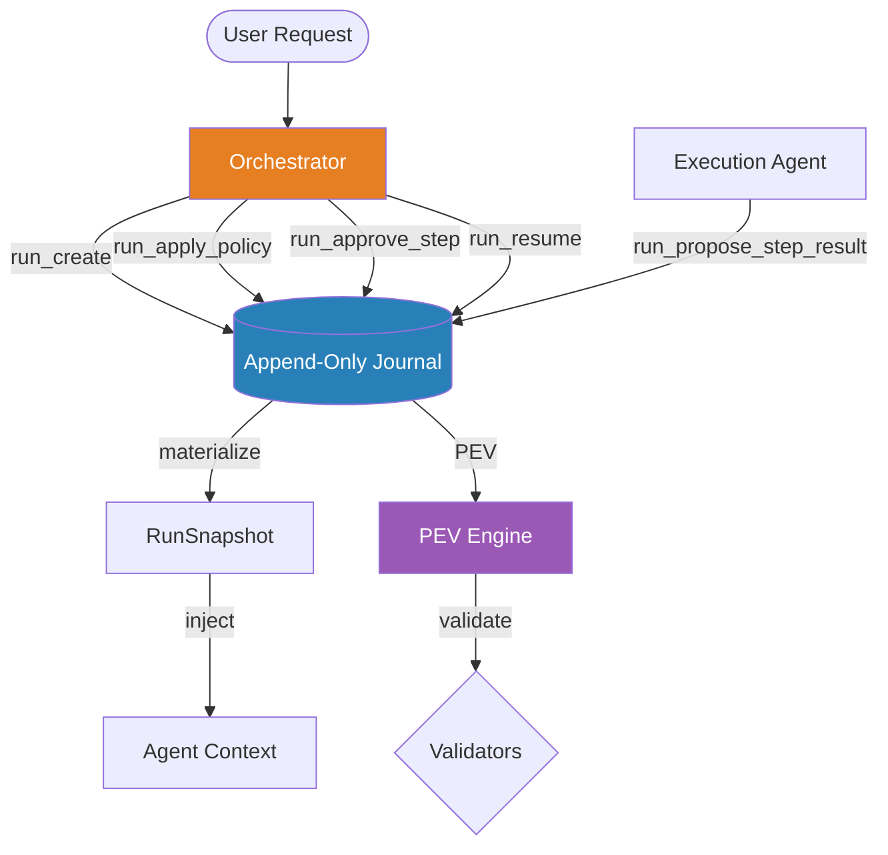

# RunLedger (Task OS)

!!! info "Durable Execution Engine"

    RunLedger is a durable execution engine for multi-agent task orchestration. It uses an append-only journal as the single source of truth, with snapshots as cached projections. Every state change is recorded as an immutable event, enabling full replay, audit, and resume.

## Architecture



### Key Components

| Component | Package | Role |
|-----------|---------|------|
| `RunLedgerStore` | `internal/runledger` | Persistence interface -- journal is the source of truth, snapshots are cached projections |
| `PEVEngine` | `internal/runledger` | Propose-Evidence-Verify engine that runs typed validators and records outcomes |
| `WorkspaceManager` | `internal/runledger` | Git worktree isolation for coding steps (Phase 3 full activation) |
| `ResumeManager` | `internal/runledger` | Detection and execution of paused run resumption |
| `BuildTools` | `internal/runledger` | Creates all `run_*` agent tools with role-based access control |

**Current storage mode**: Phase 2 introduces an Ent-backed `RunLedgerStore` when the shared
application database is available. `MemoryStore` remains for tests and non-bootstrapped paths.

## PEV Protocol

The **Propose-Evidence-Verify** cycle enforces that execution agents cannot self-certify their own work. The flow is:

```
Execution Agent ──propose──► Journal ──auto-trigger──► PEV Engine ──validate──► Validator
                                                                        │
                                                          ┌─────────────┴─────────────┐
                                                          │                           │
                                                       passed                      failed
                                                          │                           │
                                                   step_completed             PolicyRequest
                                                                                  │
                                                                           Orchestrator
                                                                        run_apply_policy
```

1. **Propose**: The execution agent calls `run_propose_step_result` with a result summary and optional evidence
2. **Evidence**: The PEV engine automatically triggers verification using the step's typed validator
3. **Verify**: The validator executes and the result is recorded in the journal
    - If validation **passes**, the step transitions to `completed`
    - If validation **fails**, a `PolicyRequest` is generated for the orchestrator

The execution agent never marks steps as complete -- only the PEV engine can do that after successful validation.

## Validators

Six built-in validator types are supported. Custom validators are intentionally not supported to prevent auto-pass bypasses.

| Validator | Type Key | Description | Target |
|-----------|----------|-------------|--------|
| Build Pass | `build_pass` | Runs `go build <target>` and checks exit code | Package path (default: `./...`) |
| Test Pass | `test_pass` | Runs `go test <target>` and checks exit code | Package path (default: `./...`) |
| File Changed | `file_changed` | Checks `git diff --name-only HEAD` for matching files | Glob pattern or substring |
| Artifact Exists | `artifact_exists` | Checks that a file exists at the target path | File path |
| Command Pass | `command_pass` | Runs an arbitrary shell command via `sh -c` | Command string |
| Orchestrator Approval | `orchestrator_approval` | Always fails auto-verification; requires explicit `run_approve_step` | None |

### Validator Spec

Each validator is configured with a `ValidatorSpec`:

```json
{
  "type": "test_pass",
  "target": "./internal/runledger/...",
  "params": {},
  "work_dir": ""
}
```

- `target`: The primary argument for the validator (package path, file pattern, command, etc.)
- `params`: Additional parameters (e.g., `expected_exit_code` for `command_pass`)
- `work_dir`: Set at runtime by the workspace manager for isolated execution

## Policy Actions

When a step fails validation, the orchestrator must respond with a policy decision. Seven actions are available:

| Action | Effect | Additional Parameters |
|--------|--------|-----------------------|
| `retry` | Reset step to `pending` and increment retry count | -- |
| `decompose` | Mark original step as done and insert new sub-steps | `new_steps_json` |
| `change_agent` | Reassign step to a different agent and reset to `pending` | `new_agent` |
| `change_validator` | Replace the validator and reset to `pending` | `new_validator_json` |
| `skip` | Mark step as completed (treat as done) | -- |
| `abort` | Fail the entire run | -- |
| `escalate` | Set current blocker and pause for human intervention | -- |

## Lifecycle

### Run Lifecycle

```
planning ──► running ──► completed
                    ├──► failed
                    └──► paused ──► running (via resume)
```

| Status | Description |
|--------|-------------|
| `planning` | Run created, plan not yet attached |
| `running` | Plan attached, steps are being executed |
| `completed` | All steps successful and all acceptance criteria met |
| `failed` | One or more steps failed terminal, or unmet acceptance criteria |
| `paused` | Run paused (e.g., session ended, escalation) |

### Step Lifecycle

```
pending ──► in_progress ──► verify_pending ──► completed
                                          └──► failed ──► pending (via retry/change_agent/change_validator)
                                                     └──► interrupted
```

| Status | Description |
|--------|-------------|
| `pending` | Not yet started, waiting for dependencies |
| `in_progress` | Execution agent is working on it |
| `verify_pending` | Result proposed, awaiting PEV validation |
| `completed` | Validation passed |
| `failed` | Validation failed, awaiting policy decision |
| `interrupted` | Externally interrupted |

### Acceptance Criteria

Acceptance criteria are validated after all steps reach a terminal state. Each criterion has its own `ValidatorSpec` and is checked independently. The run transitions to `completed` only when all steps are successful **and** all criteria are met.

## Journal Events

The journal is an append-only event log. Every mutation to run state is captured as a `JournalEvent` with an auto-incrementing sequence number.

| Event Type | Description |
|------------|-------------|
| `run_created` | New run initialized with session key, goal, and original request |
| `plan_attached` | Steps and acceptance criteria attached to the run |
| `step_started` | Execution agent began working on a step |
| `step_result_proposed` | Execution agent proposed a result with evidence |
| `step_validation_passed` | PEV engine confirmed the step result |
| `step_validation_failed` | PEV engine rejected the step result |
| `policy_decision_applied` | Orchestrator applied a policy action to a failed step |
| `note_written` | Scratchpad note attached to the run |
| `criterion_met` | An acceptance criterion was satisfied |
| `run_paused` | Run paused |
| `run_resumed` | Run resumed from paused state |
| `run_completed` | All steps and criteria satisfied |
| `run_failed` | Run terminated with failures |
| `projection_synced` | Write-through projection sync marker |

Snapshots are materialized by replaying the full journal, or by applying a tail of new events to a cached snapshot.

## Workspace Isolation

The `WorkspaceManager` provides git worktree isolation for coding-related validators (`build_pass`, `test_pass`, `file_changed`). When enabled, each step executes in an isolated worktree at `$TMPDIR/runledger/<run_id>/<step_id>`.

**Current status**: Run persistence is active in Phase 2, but runtime workspace isolation
remains disabled on purpose. The validator and workspace lifecycle code are ready, but the
app runtime does not yet wire `WithWorkspace(...)`. The later execution-isolation phase
activates full isolation via:

```go
pev.WithWorkspace(NewWorkspaceManager())
```

The isolation lifecycle:

1. Check if the step needs isolation (based on validator type)
2. Verify the main working tree is clean (fail-closed if dirty)
3. Create a git worktree with branch `runledger/<run_id>/<step_id>`
4. Set `step.Validator.WorkDir` to the worktree path
5. After validation, remove the worktree (via deferred cleanup)

Patch export (`git format-patch`) and application (`git am`) are supported for merging isolated work back to the main tree. Auto-merge is intentionally forbidden.

## Access Control

Tools are partitioned by caller role. The orchestrator and execution agents have distinct tool sets:

### Orchestrator-Only Tools

| Tool | Description |
|------|-------------|
| `run_create` | Create a new run from a planner's JSON plan |
| `run_apply_policy` | Apply a policy decision to a failed step |
| `run_approve_step` | Explicitly approve a step requiring `orchestrator_approval` |
| `run_resume` | Resume a paused run |

### Execution-Only Tools

| Tool | Description |
|------|-------------|
| `run_propose_step_result` | Propose a step result with evidence for PEV verification |

### Shared Tools (Any Role)

| Tool | Description |
|------|-------------|
| `run_read` | Read the current run snapshot |
| `run_active` | Get the currently active or next executable step |
| `run_note` | Read or write a scratchpad note on a run |

Role detection is based on the agent name in context: agents named `orchestrator` or `lango-orchestrator` are treated as orchestrators; all others are execution agents.

## Rollout Stages

RunLedger uses a progressive rollout strategy with four stages:

| Stage | Config | Description |
|-------|--------|-------------|
| **Shadow** | `shadow: true` | Journal records only; existing systems unaffected |
| **Write-Through** | `writeThrough: true` | All creates/updates go through ledger first, then mirror to projections |
| **Authoritative Read** | `authoritativeRead: true` | State reads come from ledger snapshots only |
| **Projection Retired** | _(future)_ | Legacy direct writes removed entirely |

## Resume

The `ResumeManager` handles run resumption with the following constraints:

- Resume is always **opt-in** -- no automatic revival
- Paused runs are only resumable within the `staleTtl` window (default: 1 hour)
- Resume intent detection supports both English (`resume`, `continue`) and Korean (`계속`, `이어서`, `재개`) keywords
- Runs are session-scoped: only the session that created the run can resume it

## Configuration

```yaml
runLedger:
  enabled: true
  shadow: true
  writeThrough: false
  authoritativeRead: false
  staleTtl: 1h
  maxRunHistory: 100
  validatorTimeout: 2m
  plannerMaxRetries: 2
```

| Key | Type | Default | Description |
|-----|------|---------|-------------|
| `runLedger.enabled` | bool | `false` | Enable the RunLedger system |
| `runLedger.shadow` | bool | `false` | Shadow mode: journal records only, existing systems unaffected |
| `runLedger.writeThrough` | bool | `false` | All creates/updates go through ledger first |
| `runLedger.authoritativeRead` | bool | `false` | State reads come from ledger snapshots only |
| `runLedger.staleTtl` | duration | `1h` | How long a paused run remains resumable |
| `runLedger.maxRunHistory` | int | `100` | Maximum number of runs to keep (0 = unlimited) |
| `runLedger.validatorTimeout` | duration | `2m` | Timeout for individual validator execution |
| `runLedger.plannerMaxRetries` | int | `2` | How many times a malformed planner output is retried |

## CLI Commands

### List Runs

```bash
lango run list
```

Lists recent RunLedger runs from the persistent RunLedger snapshot store when the shared
application database is available.

### Run Status

```bash
lango run status
```

Shows the current RunLedger configuration including enabled state, rollout stage, timeouts, and retry limits.

### View Journal

```bash
lango run journal
```

View the journal event log for a specific run from the persistent RunLedger journal store.

## Quick Start

1. **Enable RunLedger**:

    ```bash
    lango config set runLedger.enabled true
    ```

2. **Enable shadow mode** (recommended for initial rollout):

    ```bash
    lango config set runLedger.shadow true
    ```

3. **Verify configuration**:

    ```bash
    lango run status
    ```

4. **Interact via agent tools** -- the orchestrator creates runs from planner output and manages the execution lifecycle through `run_*` tools during conversations.
