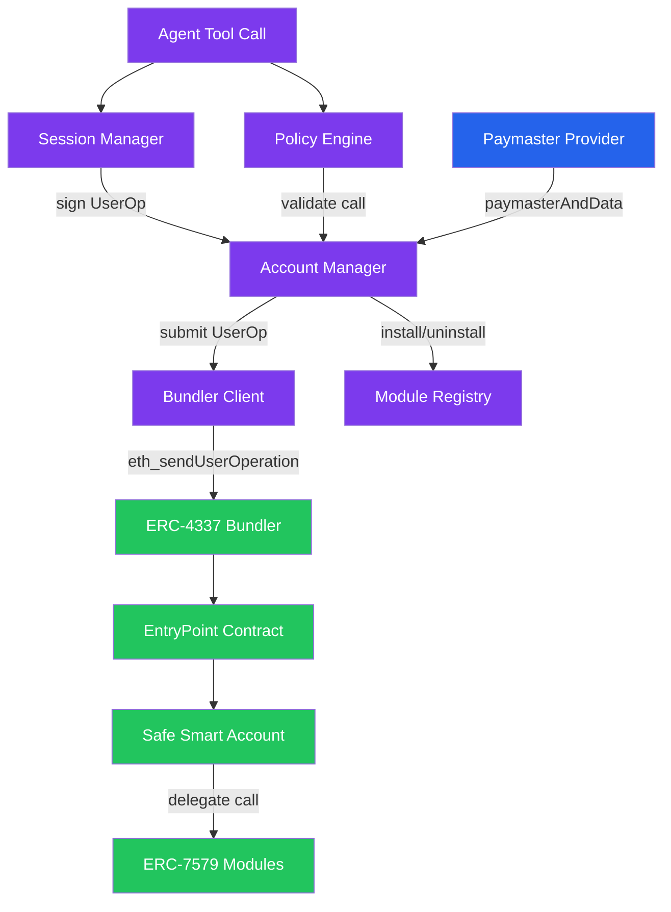
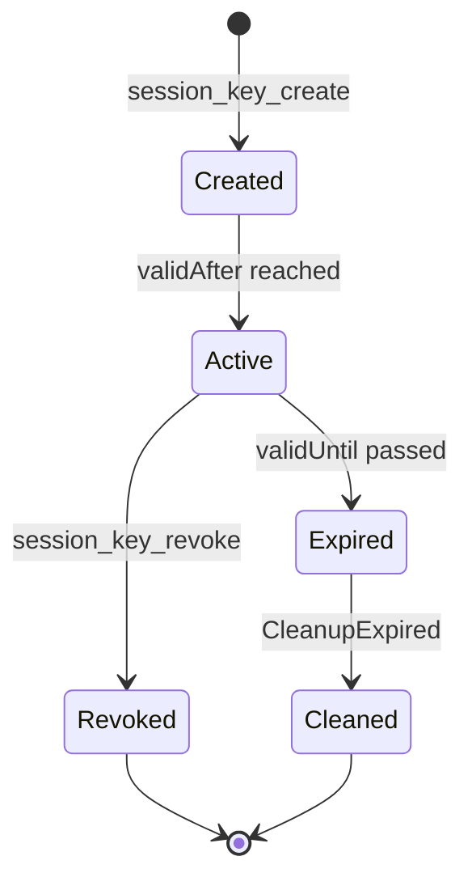

# Smart Accounts

!!! warning "Experimental"

    The smart account system is experimental. The configuration, module interfaces, and session key model may change in future releases.

Lango includes an ERC-7579 modular smart account layer that gives agents controlled autonomy over on-chain operations. The system uses Safe-based smart accounts with session key-scoped permissions, an off-chain policy engine, and ERC-4337 paymaster integration for gasless USDC transactions.

**Package**: `internal/smartaccount/`

## Overview

The smart account subsystem coordinates five components to enable secure, policy-bounded on-chain execution:

- **Account Manager** -- Safe deployment via CREATE2 and UserOp construction with ERC-4337 v0.7 signing
- **Session Manager** -- hierarchical session key lifecycle (create, list, revoke) with parent/child relationships
- **Policy Engine** -- off-chain pre-flight validation with spending limits, target/function allowlists, and risk integration
- **Module Registry** -- ERC-7579 module descriptor management (validator, executor, fallback, hook)
- **Bundler Client** -- JSON-RPC communication with an external ERC-4337 bundler



### UserOp Submission Flow

When the agent executes a contract call, the system follows a two-phase paymaster flow:

1. Build `UserOperation` with nonce from EntryPoint
2. **Phase 1**: Obtain stub `paymasterAndData` for gas estimation
3. Estimate gas via bundler (`eth_estimateUserOperationGas`)
4. **Phase 2**: Obtain final signed `paymasterAndData` with optional gas overrides
5. Compute UserOp hash (ERC-4337 v0.7 PackedUserOperation format)
6. Sign with wallet and submit via bundler (`eth_sendUserOperation`)

## Session Keys

Session keys provide scoped, time-limited signing authority over the smart account. Each key is an ECDSA key pair generated on-demand, with private key material optionally encrypted via CryptoProvider.

### Hierarchy

Session keys support a parent/child hierarchy:

- **Master sessions** (`parentId` = empty) -- root-level keys with full policy bounds
- **Task sessions** (`parentId` = master session ID) -- child keys whose policy is the intersection of parent and child constraints

When a child session is created, its policy is automatically tightened to the intersection of the parent's policy: later `validAfter`, earlier `validUntil`, smaller `spendLimit`, and the intersection of `allowedTargets` and `allowedFunctions`.

### Lifecycle



### Session Policy

Each session key carries a `SessionPolicy` that defines its operational bounds:

| Field | Type | Description |
|-------|------|-------------|
| `allowedTargets` | `[]address` | Contract addresses this key may call |
| `allowedFunctions` | `[]string` | 4-byte hex function selectors (e.g. `0xa9059cbb`) |
| `spendLimit` | `uint256` | Maximum cumulative spend for this session |
| `validAfter` | `timestamp` | Earliest time the key is valid |
| `validUntil` | `timestamp` | Latest time the key is valid |
| `allowedPaymasters` | `[]address` | Paymaster addresses this key may use (optional) |

### Configuration

| Key | Default | Description |
|-----|---------|-------------|
| `smartAccount.session.maxDuration` | `24h` | Maximum allowed session duration |
| `smartAccount.session.maxActiveKeys` | `10` | Maximum concurrent active session keys |
| `smartAccount.session.defaultGasLimit` | - | Default gas limit for session-signed UserOps |

### Revocation

Revoking a session key cascades to all children:

1. Mark the key as `revoked = true`
2. Recursively revoke all child sessions via `ListByParent`
3. If an on-chain revocation callback is set, revoke on the validator contract

## Paymaster

The paymaster subsystem enables gasless USDC transactions via ERC-4337 v0.7 paymasters. Providers are available in two modes: **RPC** (API-based) and **permit** (on-chain EIP-2612, no API key required).

### Providers

| Provider | Type String | Mode | RPC Method | Notes |
|----------|------------|------|------------|-------|
| **Circle** | `circle` | rpc | `pm_sponsorUserOperation` | API-based paymaster sponsorship |
| **Circle Permit** | `circle-permit` | permit | (on-chain) | EIP-2612 permit — no API key, pays gas in USDC |
| **Pimlico** | `pimlico` | rpc | `pm_sponsorUserOperation` | Supports `sponsorshipPolicyId` context |
| **Alchemy** | `alchemy` | rpc | `alchemy_requestGasAndPaymasterAndData` | Combined gas + paymaster endpoint with `policyId` |

### Recovery and Fallback

Each provider can be wrapped with `RecoverableProvider` for retry logic:

- **Transient errors** (e.g. timeout): retry with exponential backoff up to `maxRetries`
- **Permanent errors** (e.g. rejected, insufficient tokens): fail immediately
- **Fallback modes** when retries are exhausted:
    - `abort` -- transaction fails (default)
    - `direct` -- fall back to direct gas payment (user pays gas)

### USDC Approval

Before gasless transactions can work, the smart account must approve the paymaster to spend USDC tokens. The `paymaster_approve` tool builds an ERC-20 `approve(address,uint256)` call and executes it via UserOp.

### Configuration

| Key | Default | Description |
|-----|---------|-------------|
| `smartAccount.paymaster.enabled` | `false` | Enable paymaster integration |
| `smartAccount.paymaster.provider` | - | Provider name: `circle`, `pimlico`, or `alchemy` |
| `smartAccount.paymaster.mode` | `rpc` | Paymaster mode: `rpc` (API-based) or `permit` (on-chain EIP-2612) |
| `smartAccount.paymaster.rpcURL` | - | Paymaster RPC endpoint URL (required for `rpc` mode) |
| `smartAccount.paymaster.tokenAddress` | - | USDC token contract address |
| `smartAccount.paymaster.paymasterAddress` | - | Paymaster contract address |
| `smartAccount.paymaster.policyId` | - | Sponsorship policy ID (Pimlico/Alchemy) |
| `smartAccount.paymaster.fallbackMode` | `abort` | Behavior when paymaster fails: `abort` or `direct` |

## Policy Engine

The policy engine performs off-chain pre-flight validation before any contract call reaches the bundler. It checks each call against a `HarnessPolicy` bound to the smart account address and tracks cumulative spending via `SpendTracker`.

### Harness Policy

| Constraint | Type | Description |
|------------|------|-------------|
| `MaxTxAmount` | `uint256` | Maximum value per single transaction |
| `DailyLimit` | `uint256` | Maximum cumulative daily spend |
| `MonthlyLimit` | `uint256` | Maximum cumulative monthly spend (30-day window) |
| `AllowedTargets` | `[]address` | Whitelist of callable contract addresses |
| `AllowedFunctions` | `[]string` | Whitelist of 4-byte function selectors |
| `AutoApproveBelow` | `uint256` | Auto-approve threshold (no confirmation needed) |
| `RequiredRiskScore` | `float64` | Minimum risk score from the economy risk engine |

### Validation Order

The validator checks constraints in this order:

1. **MaxTxAmount** -- reject if `call.Value > policy.MaxTxAmount`
2. **AllowedTargets** -- reject if target address is not in the whitelist
3. **AllowedFunctions** -- reject if function selector is not in the whitelist
4. **DailyLimit** -- reject if `dailySpent + call.Value > dailyLimit`
5. **MonthlyLimit** -- reject if `monthlySpent + call.Value > monthlyLimit`

The spend tracker automatically resets daily (24h window) and monthly (30-day window) counters.

### Policy Merging

When master and task policies coexist, `MergePolicies` produces the intersection (tighter bound for each field): the smaller of each limit, the higher of each risk score, and the address/function intersection of each list.

### On-Chain Sync

The `Syncer` bridges Go-side harness policies with the on-chain `LangoSpendingHook` contract:

- **PushToChain** -- writes `MaxTxAmount`, `DailyLimit`, `MonthlyLimit` as `setLimits(perTxLimit, dailyLimit, cumulativeLimit)`
- **PullFromChain** -- reads on-chain config and updates the Go-side policy
- **DetectDrift** -- compares Go-side and on-chain policies, returning a `DriftReport` with any differences

### Risk Integration

The policy engine accepts a `RiskPolicyFunc` callback that dynamically generates policy constraints from the economy risk assessor based on peer DID. This enables risk-based spending limits.

## Module Registry

The module registry manages ERC-7579 module descriptors. Each module has a `ModuleDescriptor` with name, address, type, version, and optional init data.

### Module Types

| Type ID | Name | Description | Example |
|---------|------|-------------|---------|
| 1 | Validator | Validates UserOp signatures | `LangoSessionValidator` |
| 2 | Executor | Executes operations on behalf of the account | `LangoEscrowExecutor` |
| 3 | Fallback | Handles calls to unrecognized function selectors | - |
| 4 | Hook | Pre/post execution hooks for policy enforcement | `LangoSpendingHook` |

### Module Installation

Module installation goes through the Safe7579 adapter:

1. Encode `installModule(moduleType, address, initData)` via Safe7579 ABI
2. Build and sign a UserOp with the encoded calldata
3. Submit via bundler
4. Track the module locally in the `Manager.modules` slice

Uninstallation follows the same pattern with `uninstallModule`.

### Configuration

| Key | Default | Description |
|-----|---------|-------------|
| `smartAccount.modules.sessionValidatorAddress` | - | Deployed LangoSessionValidator contract address |
| `smartAccount.modules.spendingHookAddress` | - | Deployed LangoSpendingHook contract address |
| `smartAccount.modules.escrowExecutorAddress` | - | Deployed LangoEscrowExecutor contract address |

## Agent Tools

| Tool | Safety | Description |
|------|--------|-------------|
| `smart_account_deploy` | dangerous | Deploy a new Safe smart account with ERC-7579 modules |
| `smart_account_info` | safe | Get smart account information without deploying |
| `session_key_create` | dangerous | Create a session key with scoped permissions (targets, functions, spend limit, duration) |
| `session_key_list` | safe | List all session keys and their status |
| `session_key_revoke` | dangerous | Revoke a session key and all its child sessions |
| `session_execute` | dangerous | Execute a contract call using a session key (policy check, sign, submit) |
| `policy_check` | safe | Dry-run a contract call against the policy engine |
| `module_install` | dangerous | Install an ERC-7579 module on the smart account |
| `module_uninstall` | dangerous | Uninstall an ERC-7579 module from the smart account |
| `spending_status` | safe | View on-chain spending status and registered module information |
| `paymaster_status` | safe | Check paymaster configuration and provider type |
| `paymaster_approve` | dangerous | Approve USDC spending for the paymaster (enables gasless transactions) |

## Integration Points

The smart account system integrates with several other Lango subsystems:

- **Economy Risk Engine** -- the policy engine accepts a `RiskPolicyFunc` callback to dynamically adjust spending limits based on peer trust scores (see [P2P Economy](economy.md))
- **Security Sentinel** -- sentinel anomaly detection can trigger emergency session revocation via the session manager's `RevokeAll` method
- **On-Chain Spending Tracker** -- the `session_execute` tool records spending to an on-chain tracker, which feeds back into the policy engine's budget tracking
- **Escrow Executor** -- the `LangoEscrowExecutor` module enables the smart account to interact with escrow contracts directly (see [Contracts](contracts.md))

## Configuration

> **Settings:** `lango settings` -> Smart Account

```json
{
  "smartAccount": {
    "enabled": true,
    "factoryAddress": "0x...",
    "entryPointAddress": "0x0000000071727De22E5E9d8BAf0edAc6f37da032",
    "safe7579Address": "0x...",
    "fallbackHandler": "0x...",
    "bundlerURL": "https://bundler.example.com/rpc",
    "session": {
      "maxDuration": "24h",
      "defaultGasLimit": "500000",
      "maxActiveKeys": 10
    },
    "paymaster": {
      "enabled": true,
      "provider": "circle",
      "mode": "permit",
      "tokenAddress": "0x036CbD53842c5426634e7929541eC2318f3dCF7e",
      "paymasterAddress": "0x31BE08D380A21fc740883c0BC434FcFc88740b58",
      "fallbackMode": "abort"
    },
    "modules": {
      "sessionValidatorAddress": "0x...",
      "spendingHookAddress": "0x...",
      "escrowExecutorAddress": "0x..."
    }
  }
}
```
