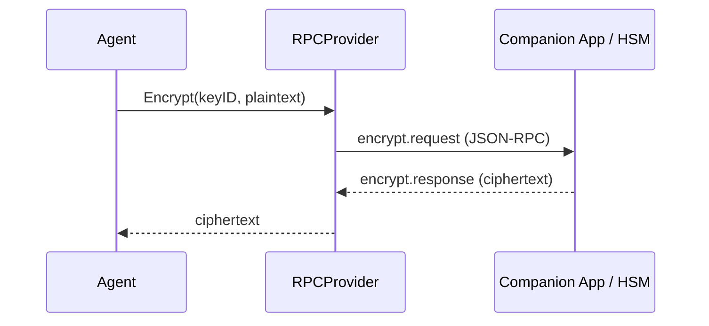

# Encryption & Secrets

Lango encrypts all sensitive data using AES-256-GCM and manages cryptographic keys through a registry backed by the Ent ORM. Two security modes are available depending on your deployment.

## Security Modes

### Local Mode (Default)

Local mode uses a **Master Key (MK) envelope** architecture. A random 32-byte Master Key encrypts all data (AES-256-GCM). The passphrase does not encrypt data directly — it derives a Key Encryption Key (KEK) that wraps/unwraps the MK.

```
Passphrase → PBKDF2 → KEK → wraps Master Key (AES-256-GCM)
                              ├── Data Encryption: secrets, config profiles
                              └── DB Key: HKDF(MK, "lango-db-encryption")
```

=== "Interactive"

    During onboarding (`lango onboard`) or first startup, Lango prompts for a passphrase:

    ```
    Enter encryption passphrase (min 8 characters): ********
    Confirm passphrase: ********
    ```

=== "Headless"

    For CI/CD or server deployments, provide a keyfile:

    ```bash
    echo "your-secure-passphrase" > ~/.lango/keyfile
    chmod 600 ~/.lango/keyfile
    lango serve
    ```

!!! info "Recovery Mnemonic"

    Lango supports a BIP39 recovery mnemonic as an alternative KEK slot. If you lose your passphrase, the mnemonic can unwrap the Master Key and restore access. Set it up with:

    ```bash
    lango security recovery setup
    ```

    Without a recovery mnemonic, losing your passphrase means permanent loss of all encrypted data.

**Key Hierarchy:**

| Layer | Parameter | Value |
|-------|-----------|-------|
| KEK derivation | Algorithm | PBKDF2-SHA256, 100,000 iterations |
| KEK derivation | Salt | 128 bits (16 bytes), per-slot |
| MK wrapping | Cipher | AES-256-GCM |
| Data encryption | Key | Master Key (256 bits, random) |
| Data encryption | Cipher | AES-256-GCM, 96-bit nonce |
| DB key | Derivation | HKDF-SHA256(MK, "lango-db-encryption") |
| Identity key | Derivation | HKDF-SHA256(MK, "lango-identity-ed25519") → Ed25519 |

**Identity Bundle:**

When the Master Key is available, Lango derives an Ed25519 identity key and creates an **Identity Bundle** (`~/.lango/identity-bundle.json`). The bundle contains the Ed25519 signing key, secp256k1 settlement key (from wallet), and dual proofs. A content-addressed DID v2 (`did:lango:v2:<hash>`) is computed from the bundle. The legacy v1 DID (`did:lango:<secp256k1-hex>`) is preserved for backward compatibility.

**Envelope File:**

The Master Key envelope is stored at `~/.lango/envelope.json` (0600 permissions). It contains KEK slots (passphrase, mnemonic), KDF metadata, and crash recovery flags. The envelope is readable without opening the database.

**Change Passphrase:**

To change the passphrase without re-encrypting data:

```bash
lango security change-passphrase
```

This re-wraps the Master Key with a new passphrase-derived KEK. Because the MK itself does not change, no data re-encryption or DB rekey is needed — the operation is O(1).

!!! note "Legacy Command"
    `lango security migrate-passphrase` is deprecated. Use `change-passphrase` instead.

See [Envelope Migration](envelope-migration.md) for details on upgrading from legacy installations.

### RPC Mode (Production)

RPC mode delegates all cryptographic operations (sign, encrypt, decrypt) to an external signer -- typically a hardware-backed companion app or HSM. Private keys never leave the secure hardware boundary.



Each RPC request has a 30-second timeout. If the companion is unreachable, the **Composite Provider** automatically falls back to local mode (if configured).

Configure RPC mode:

> **Settings:** `lango settings` → Security

```json
{
  "security": {
    "signer": {
      "provider": "rpc",
      "rpcUrl": "https://companion.local:8443",
      "keyId": "primary-signing-key"
    }
  }
}
```

### Cloud KMS Mode

Cloud KMS mode delegates cryptographic operations to a managed key service. Four backends are supported:

| Backend | Provider | Build Tag | Key Types |
|---------|----------|-----------|-----------|
| AWS KMS | `aws-kms` | `kms_aws` | ECDSA_SHA_256 signing, SYMMETRIC_DEFAULT encrypt/decrypt |
| GCP Cloud KMS | `gcp-kms` | `kms_gcp` | AsymmetricSign SHA-256, symmetric encrypt/decrypt |
| Azure Key Vault | `azure-kv` | `kms_azure` | ES256 signing, RSA-OAEP encrypt/decrypt |
| PKCS#11 HSM | `pkcs11` | `kms_pkcs11` | CKM_ECDSA signing, CKM_AES_GCM encrypt/decrypt |

Build with the appropriate tag to include the Cloud SDK dependency:

```bash
# Single provider
go build -tags kms_aws ./cmd/lango

# All providers
go build -tags kms_all ./cmd/lango
```

Without a build tag, the provider returns a stub error at runtime.

The **CompositeCryptoProvider** wraps any KMS backend with automatic local fallback when `kms.fallbackToLocal` is enabled. KMS calls include exponential backoff retry logic for transient errors (throttling, network timeouts) and a health checker with a 30-second probe cache.

Configure Cloud KMS:

> **Settings:** `lango settings` → Security

```json
{
  "security": {
    "signer": {
      "provider": "aws-kms"
    },
    "kms": {
      "region": "us-east-1",
      "keyId": "arn:aws:kms:us-east-1:123456789012:key/example-key",
      "fallbackToLocal": true,
      "timeoutPerOperation": "5s",
      "maxRetries": 3
    }
  }
}
```

For Azure Key Vault, also specify the vault URL:

```json
{
  "security": {
    "signer": { "provider": "azure-kv" },
    "kms": {
      "keyId": "my-signing-key",
      "azure": {
        "vaultUrl": "https://myvault.vault.azure.net"
      }
    }
  }
}
```

For PKCS#11 HSM:

```json
{
  "security": {
    "signer": { "provider": "pkcs11" },
    "kms": {
      "pkcs11": {
        "modulePath": "/usr/lib/softhsm/libsofthsm2.so",
        "slotId": 0,
        "keyLabel": "lango-signing-key"
      }
    }
  }
}
```

!!! tip "PKCS#11 PIN"
    Set the PIN via `LANGO_PKCS11_PIN` environment variable instead of storing it in configuration.

## Secret Management

Agents manage encrypted secrets through tool workflows. Secrets are stored in the Ent database with AES-256-GCM encryption and referenced by name -- plaintext values never appear in logs or agent output.

### How It Works

1. A secret is stored via CLI or tool call with a name and value
2. The value is encrypted using the default encryption key from the Key Registry
3. The agent receives a **reference token** (`{{secret:name}}`) instead of the plaintext
4. When a tool needs the actual value, the RefStore resolves the token just before execution
5. The output scanner replaces any leaked values with `[SECRET:name]` placeholders

```
User: "Store my API key: sk-abc123"
Agent stores → {{secret:api_key}}
Tool uses   → RefStore resolves {{secret:api_key}} → sk-abc123
Output      → Scanner replaces sk-abc123 → [SECRET:api_key]
```

### Output Scanning

The secret scanner monitors all agent output for plaintext secret values. When a match is found, it replaces the value with a safe placeholder:

```
Agent output: "Connected using key sk-abc123"
Scanned output: "Connected using key [SECRET:api_key]"
```

This prevents accidental secret leakage through chat messages, logs, or tool output.

## Hardware Keyring Integration

Lango can store the master passphrase using hardware-backed security, eliminating the need for keyfiles or interactive prompts on every startup. Only hardware-backed backends are supported to prevent same-UID attacks.

**Passphrase Source Priority:**

1. **Hardware keyring** (Touch ID / TPM when available and a passphrase is stored)
2. **Keyfile** (`~/.lango/keyfile` or `LANGO_KEYFILE` path)
3. **Interactive prompt** (terminal input)
4. **Stdin** (piped input for CI/CD)

**Supported Hardware Backends:**

| Platform | Backend | Security Level |
|----------|---------|----------------|
| macOS | Touch ID (Secure Enclave) | Biometric |
| Linux | TPM 2.0 sealed storage | Hardware |

Manage via CLI:

```bash
lango security keyring store    # Store passphrase in hardware backend
lango security keyring status   # Check hardware keyring availability
lango security keyring clear    # Remove stored passphrase
```

!!! note "No Hardware Backend"
    On systems without Touch ID or TPM 2.0, the keyring commands are unavailable. Use keyfile or interactive prompt instead.

## Database Encryption

The current runtime no longer supports SQLCipher page-level database encryption. Instead, Lango uses **broker-managed payload protection**: sensitive content is encrypted with AES-256-GCM at the application layer while redacted plaintext projections remain available for FTS5 search and recall.

**Current behavior:**

1. The SQLite database is opened with the default pure-Go runtime driver.
2. Sensitive payloads are encrypted and decrypted through the storage broker using keys derived from the Master Key envelope.
3. Searchable fields store **redacted projections**, not raw plaintext secrets.

Legacy compatibility:

- `security.dbEncryption.*` is still parsed from older configs, but ignored by the runtime.
- `lango security db-migrate` and `lango security db-decrypt` remain only as remediation signposts and return an unsupported message.
- If the runtime sees a non-SQLite DB header, it treats it as a **legacy encrypted or unreadable DB** and fails fast with remediation guidance.

```json
{
  "security": {
    "dbEncryption": {
      "enabled": false,
      "cipherPageSize": 4096
    }
  }
}
```

!!! note "Legacy SQLCipher Databases"
    If you still have an old SQLCipher-encrypted database, use an older build to export or decrypt it before upgrading. The current runtime does not attempt to unlock or migrate SQLCipher files in place.

## Key Registry

The Key Registry is an Ent-backed store that manages encryption and signing keys. Each key has a type, a name, and an optional remote key ID (for RPC mode).

**Key Types:**

| Type | Purpose |
|------|---------|
| `encryption` | AES-256-GCM encryption/decryption |
| `signing` | HMAC-SHA256 signing (local) or remote signature (RPC) |

The registry tracks key metadata including creation time and last-used timestamp, enabling key rotation auditing.

## Wallet Key Security

When blockchain payments are enabled, wallet private keys are managed through the same security infrastructure:

| Mode | Storage | Signing |
|------|---------|---------|
| **Local** | Derived from passphrase, stored encrypted | In-process ECDSA |
| **RPC** | Keys remain on companion/hardware signer | Remote signing via RPC |

**Spending Limits** provide an additional safety layer:

> **Settings:** `lango settings` → Security

```json
{
  "payment": {
    "limits": {
      "maxPerTx": "1.00",
      "maxDaily": "10.00"
    }
  }
}
```

## Companion App Discovery

!!! warning "Experimental"

    Companion app discovery is an experimental feature and may change in future releases.

Lango can auto-discover companion apps on the local network using mDNS:

- **Service type:** `_lango-companion._tcp`
- **Discovery:** Automatic on startup when RPC mode is configured
- **Fallback:** Manual configuration via `security.signer.rpcUrl`

If mDNS discovery fails, configure the companion URL explicitly:

> **Settings:** `lango settings` → Security

```json
{
  "security": {
    "signer": {
      "provider": "rpc",
      "rpcUrl": "https://192.168.1.100:8443"
    }
  }
}
```

## CLI Commands

### Security Status

```bash
lango security status
```

Displays the current security configuration: encryption mode, key count, secret count, and companion connection status.

### Passphrase Migration

```bash
lango security migrate-passphrase
```

Re-encrypts all secrets and keys under a new passphrase. Prompts for both old and new passphrase.

### Secret Management

```bash
# List all secrets (metadata only, no values)
lango security secrets list

# Store a secret
lango security secrets set <name> <value>

# Delete a secret
lango security secrets delete <name>
```

!!! tip "Secret Names"

    Use descriptive, namespaced names for secrets: `openai/api-key`, `telegram/bot-token`, `wallet/private-key`. This makes it easier to manage secrets across integrations.

## Configuration Reference

> **Settings:** `lango settings` → Security

```json
{
  "security": {
    "interceptor": {
      "enabled": true,
      "redactPii": true,
      "approvalPolicy": "dangerous"
    },
    "signer": {
      "provider": "local",
      "rpcUrl": "",
      "keyId": ""
    },
    "dbEncryption": {
      "enabled": false,
      "cipherPageSize": 4096
    },
    "kms": {
      "region": "",
      "keyId": "",
      "fallbackToLocal": true,
      "timeoutPerOperation": "5s",
      "maxRetries": 3,
      "azure": {
        "vaultUrl": ""
      },
      "pkcs11": {
        "modulePath": "",
        "slotId": 0,
        "keyLabel": ""
      }
    }
  }
}
```
